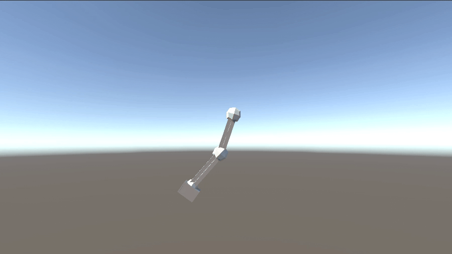

# Animación de Pierna con Cinemática Directa en Unity

En este punto se describe cómo se desarrolló la animación de una pierna en Unity utilizando **cinemática directa (Forward Kinematics, FK)**. Se partió de un modelo descargado desde SketchUp y se organizó la escena de acuerdo con el esquema mostrado en la imagen adjunta.

## Estructura de la escena implementada

La escena se organizó con la siguiente estructura jerárquica:

```
SampleScene
├── Main Camera
├── Directional Light
├── Global Volume
├── SETUP_FK
│   ├── SetupFK_ANM_Epaule
│   │   └── SetupFK_HIDE_Epaule
│   │       └── SetupFK_SKN_Bras
│   │           └── SetupFK_SKN_AvantBras
│   └── SetupFK_MESH
├── Leg_FK_Controller
└── Camera
```

### Componentes configurados
- **SETUP_FK:** Contiene la cadena ósea (`SetupFK_ANM_Epaule` → `SetupFK_HIDE_Epaule` → `SetupFK_SKN_Bras` → `SetupFK_SKN_AvantBras`) y la malla (`SetupFK_MESH`).
- **Leg_FK_Controller:** Controlador responsable de aplicar las rotaciones FK a los huesos relevantes.
- **Main Camera**, **Camera**, **Directional Light**, **Global Volume:** Elementos de escena utilizados en la configuración.

Con esta estructura se garantizó que el controlador FK manipulara únicamente los huesos relevantes de la pierna.

## Metodología aplicada

Se aplicó **cinemática directa** para calcular la pose final del sistema articulado de la pierna, realizando rotaciones locales de manera secuencial desde el hueso raíz (muslo) hasta el extremo (pie/punta).

- Se definió un control explícito: el ángulo de cada articulación se asignó directamente mediante las variables `musloZ`, `gemeloZ`, `pieZ` y `puntaZ`.
- No se utilizó resolución automática de posición final; cada segmento siguió el ángulo especificado por código.
- Esta elección proporcionó máximo control, conveniente para ciclos como caminar o correr, donde se conoce el movimiento esperado de cada hueso.

## Scripts implementados

### 1. LegFKController.cs

Se implementó un controlador de cinemática directa para la pierna. Este script permitió asignar los huesos en el orden correcto (muslo, gemelo, pie, punta) y aplicar las rotaciones locales sobre el eje Z.

- La función principal `AplicarFK()` rotó directamente los huesos según los ángulos:
  ```csharp
  muslo.localRotation = Quaternion.Euler(0f, 0f, musloZ);
  gemelo.localRotation = Quaternion.Euler(0f, 0f, gemeloZ);
  pie.localRotation = Quaternion.Euler(0f, 0f, pieZ);
  punta.localRotation = Quaternion.Euler(0f, 0f, puntaZ);
  ```
- Los ángulos quedaron disponibles para ser modificados desde el inspector de Unity o vía script.

### 2. WalkCycle.cs

Se implementó un ciclo de caminata controlando los ángulos de los huesos mediante funciones seno/coseno, con el fin de simular un movimiento natural.

- Se controlaron la frecuencia (velocidad del paso), la amplitud (grado de flexión por articulación) y el desfase de las articulaciones para crear una secuencia fluida:
  ```csharp
  float musloZ = Mathf.Sin(timeCounter) * musloAmplitude;
  float rawGemelo = Mathf.Sin(timeCounter + gemeloPhase);
  float pieZ = Mathf.Sin(timeCounter + piePhase) * pieAmplitude;
  ```
- En el gemelo se ajustó flexión/extensión para dar realismo:
  - Flexión hacia atrás proporcional a la amplitud.
  - Extensión hacia delante limitada a cero.

## Flujo de ejecución en la solución

1. **Preparación de la escena:** Se importó el modelo y se creó la jerarquía de huesos (muslo, gemelo, pie, punta).
2. **Asignación:** Se colocó el script `LegFKController` en el GameObject controlador y se asignaron los Transforms de los huesos en el inspector.
3. **Animación automática:** El script `WalkCycle` generó y asignó los ángulos en tiempo real para simular un ciclo de caminata, llamando a `SetPose()` en cada frame.
4. **Visualización:** La pierna se animó en Unity según los valores de amplitud, frecuencia y fase definidos en el script.

## Resultado final




# Animación de Grúa con Cinemática Inversa en Unity

En este punto se presenta el desarrollo de una **animación de grúa** mediante **cinemática inversa (IK)** en Unity, utilizando el package oficial de Animation Rigging. Se documenta la configuración de la escena, la aplicación del método IK para controlar el gancho de la grúa y la manipulación del target vía script.

## Estructura de la escena implementada

La escena se organizó con la siguiente estructura jerárquica:

```
SampleScene
├── Crane
│   └── Body
│       └── Pivot_Boom_Base
│           └── Front_Crane
│               └── Pivot_RopeAttach
│                   └── Rope
│                       └── Pivot_Hook
├── Wheels
│   ├── ...
│   └── ...
├── Rig 1
│   └── gancho
│       ├── gancho_target
│       └── gancho_hint
├── Camera
```

### Componentes configurados
- **Crane:** GameObject principal con sus partes jerárquicamente estructuradas.
- **Rig 1:** Contiene el objeto 'gancho', al que se le aplicó el constraint de dos huesos (Two Bone IK Constraint).
- **gancho:** Nodo al que se añadió el **Two Bone IK Constraint** para controlar el movimiento del gancho final.
- **gancho_target:** Objetivo (target) para la posición final del gancho que puede moverse durante la ejecución.
- **gancho_hint:** Nodo hint opcional para ajuste fino del ángulo del codo (en el brazo de la grúa).

## Metodología aplicada (Cinemática Inversa)

Se empleó **cinemática inversa (IK)** para resolver automáticamente los ángulos necesarios en cada articulación de la cadena ósea (brazo de la grúa), de modo que el extremo (gancho) alcanzara una posición objetivo especificada.

- Se utilizó el **Two Bone IK Constraint** de Animation Rigging para controlar el brazo articulado (base – cuerda – gancho).
- La posición de `gancho_target` se manipuló como objetivo, y el constraint ajustó automáticamente los ángulos del sistema para posicionar el gancho en dicho objetivo.
- El movimiento se planteó como interactivo, ya sea mediante teclado, arrastre en la escena o desde código.

**Ventajas observadas:**
- Adecuado para brazos/estructuras con 2 o 3 segmentos.
- Facilita animaciones interactivas y precisas con menor complejidad de implementación.
- Se adapta automáticamente aunque cambien longitudes/direcciones de la grúa.

## Script implementado: GanchoTargetController

Para mover el target (`gancho_target`) y animar el gancho de la grúa, se implementó el siguiente script en C#:

```csharp
using UnityEngine;

public class GanchoTargetController : MonoBehaviour
{
    [Header("Límites de Movimiento")]
    [SerializeField] private float minX = -12f;
    [SerializeField] private float maxX = -8f;
    [SerializeField] private float minY = 4f;
    [SerializeField] private float maxY = 9f;
    
    [Header("Configuración de Velocidad")]
    [SerializeField] private float speed = 2f;
    
    private Vector3 targetPosition;
    private float constantZ;

    void Start()
    {
        // Guardar la posición Z inicial como constante
        constantZ = transform.position.z;
        targetPosition = transform.position;
    }

    void Update()
    {
        float horizontal = Input.GetAxis("Horizontal");
        float vertical = Input.GetAxis("Vertical");
        targetPosition.x += horizontal * speed * Time.deltaTime;
        targetPosition.y += vertical * speed * Time.deltaTime;
        targetPosition.x = Mathf.Clamp(targetPosition.x, minX, maxX);
        targetPosition.y = Mathf.Clamp(targetPosition.y, minY, maxY);
        targetPosition.z = constantZ;
        transform.position = targetPosition;
    }

    public void MoverA(float x, float y)
    {
        targetPosition.x = Mathf.Clamp(x, minX, maxX);
        targetPosition.y = Mathf.Clamp(y, minY, maxY);
        targetPosition.z = constantZ;
        transform.position = targetPosition;
    }

    public void MoverSuaveA(float x, float y, float velocidad)
    {
        Vector3 destino = new Vector3(
            Mathf.Clamp(x, minX, maxX),
            Mathf.Clamp(y, minY, maxY),
            constantZ
        );
        StartCoroutine(MovimientoSuave(destino, velocidad));
    }

    private System.Collections.IEnumerator MovimientoSuave(Vector3 destino, float velocidad)
    {
        while (Vector3.Distance(transform.position, destino) > 0.01f)
        {
            transform.position = Vector3.Lerp(
                transform.position, 
                destino, 
                velocidad * Time.deltaTime
            );
            yield return null;
        }
        transform.position = destino;
    }
}
```

Con este script se logró:
- Mover el target del gancho con las flechas del teclado dentro de un rango restringido.
- Exponer funciones para que otros scripts/UI muevan el gancho de forma directa o suave.
- Actualizar la cadena ósea vía IK cuando el target cambia, gracias a la configuración de Animation Rigging.

## Flujo de la animación en la solución
1. El objetivo (`gancho_target`) se mueve en la escena.
2. El **Two Bone IK Constraint** ajusta automáticamente los ángulos de los huesos (brazo de la grúa) para que el gancho siga al objetivo.
3. El usuario puede mover el gancho de forma interactiva, y la animación se produce de manera fluida y natural.

La lógica esencial la resolvió Unity; el cálculo matemático de ángulos está embebido en el constraint, por lo que basta con mover el target.

## Resultado final


# Proceso Detallado de la Animación de Carrera 200m en Unity

La animación de una carrera de 200 metros en Unity, utilizando el modelo Banana Man y una pista de atletismo, es un proyecto que integra modelado de escenario, importación y control de animaciones, programación de trayectorias y manejo de cámara para lograr un resultado realista y didáctico. A continuación, te explico el proceso completo, con énfasis en los scripts y los principios de animación aplicados.

## Creación del Escenario: Pista de Atletismo

El primer paso fue diseñar el entorno donde se desarrollaría la animación. Se utilizó un objeto "Plane" de Unity para representar el suelo. Sobre este plano se aplicó una textura de pista de atletismo, importada como imagen y convertida en material. Esto permitió que el plano simulara visualmente una pista real, con sus carriles y curvas. Para mayor precisión en la trayectoria, se colocaron GameObjects vacíos en la escena, que sirvieron como marcadores de los puntos clave: la salida, el pico de la curva, el final de la curva y la meta. Estos objetos no son visibles en la animación final, pero son fundamentales para definir la ruta que seguirá el corredor.

## Importación y Preparación del Modelo: Banana Man

El modelo Banana Man, disponible gratuitamente en los assets de Unity, fue importado al proyecto y colocado en la posición de salida de la pista. Este modelo es compatible con el sistema de animaciones humanoides de Unity, lo que facilita la integración de animaciones externas, como las de Mixamo. Se le añadió un componente Animator, que permite controlar las animaciones del personaje mediante un Animator Controller.

## Integración de la Animación de Correr desde Mixamo

Para dotar al Banana Man de un movimiento realista, se descargó una animación de correr desde Mixamo, una plataforma que ofrece animaciones humanoides gratuitas. La animación se exportó en formato FBX, seleccionando la opción "sin skin" para que solo incluyera el movimiento. Al importar el archivo en Unity, se configuró el rig como "Humanoid" para asegurar la compatibilidad con el modelo Banana Man. La animación se arrastró al Animator Controller del personaje, y se configuró para reproducirse cuando el personaje estuviera en movimiento. De este modo, el Banana Man adopta una postura y ritmo de carrera realistas mientras recorre la pista.

## Programación de la Trayectoria: Script de Movimiento Paramétrico

El corazón de la animación es el script que controla la trayectoria del corredor. En vez de depender de una ruta dibujada manualmente, el script toma como entrada los objetos de referencia (salida, pico de curva, final de curva y meta) y calcula la ruta automáticamente. El método principal, `GenerarRutaMediaCircunferencia`, utiliza las posiciones de estos objetos para calcular el centro y el radio de la circunferencia que define la curva de la pista. Luego, interpola puntos a lo largo de la media circunferencia usando funciones trigonométricas, generando así una secuencia de posiciones suaves y realistas para la curva.

El script mueve al Banana Man de punto en punto usando `Vector3.MoveTowards`, y en cada frame ajusta la rotación del personaje con `Quaternion.Slerp` para que siempre mire hacia el siguiente destino. Esto evita movimientos robóticos y permite que el personaje anticipe los giros, especialmente en la curva. Al finalizar la curva, el script dirige al personaje en línea recta hacia la meta. Una vez cruzada la meta, el Banana Man sigue corriendo durante dos segundos más, simulando la inercia típica de los corredores reales antes de detenerse. Este comportamiento se controla con un temporizador y una dirección calculada a partir de la última sección de la ruta.

**Fragmento explicativo del código:**

```csharp
void MoverYRotar(Vector3 destino, float umbral) {
    Vector3 direccion = destino - transform.position;
    direccion.y = 0;
    if (direccion.sqrMagnitude > umbral * umbral) {
        Quaternion rotacion = Quaternion.LookRotation(direccion);
        transform.rotation = Quaternion.Slerp(transform.rotation, rotacion, 6f * Time.deltaTime);
    }
    transform.position = Vector3.MoveTowards(transform.position, destino, velocidad * Time.deltaTime);
}
```

Este método asegura que el personaje avance suavemente hacia cada punto de la ruta y rote de manera natural, evitando oscilaciones o giros bruscos, especialmente a velocidades bajas.

## Script de Cámara: Seguimiento Estilo Televisión Oficial

Para lograr una experiencia visual similar a las transmisiones oficiales de atletismo, se implementó un script de cámara que sigue al Banana Man de manera lateral y paralela a la recta de 100 m. A diferencia de una cámara de tercera persona tradicional, esta cámara no rota para mirar siempre al personaje, sino que mantiene una orientación fija y se desplaza en paralelo, como si estuviera montada sobre un raíl al costado de la pista. El script ajusta la posición de la cámara en cada frame para mantener al atleta en el encuadre, pero sin cambiar el ángulo de visión, logrando así el efecto de cámara televisiva.

**Fragmento explicativo del código de cámara:**

```csharp
public Transform atleta;
public float altura = 7f;
public float offsetFrontal = 15f;

void LateUpdate() {
    if (atleta == null) return;
    Vector3 pos = atleta.position;
    pos.z += offsetFrontal; // Cámara paralela a la recta
    pos.y += altura;
    transform.position = pos;
    Vector3 mirar = atleta.position;
    mirar.y = pos.y;
    transform.LookAt(mirar);
}
```

Este código mantiene la cámara a una distancia y altura constantes respecto al corredor, y siempre mirando hacia él desde el costado, sin rotaciones innecesarias.

## Principios de Animación Aplicados

Durante el desarrollo de la animación, se aplicaron varios de los 12 principios clásicos de la animación para lograr un movimiento creíble y atractivo:

- **Arcos:** El movimiento de la curva se genera mediante interpolación circular, asegurando que el corredor siga una trayectoria suave y natural, en vez de líneas rectas o ángulos bruscos.
- **Anticipación:** El script de rotación hace que el Banana Man gire suavemente antes de cada cambio de dirección, especialmente al entrar y salir de la curva, preparando visualmente al espectador para el giro.
- **Timing y Espaciado:** La velocidad del corredor es constante y el espaciado entre los puntos de la ruta es uniforme, lo que permite un ritmo realista y controlado durante toda la animación.
- **Follow Through (Arrastre):** Tras cruzar la meta, el personaje sigue corriendo durante dos segundos más, mostrando la inercia natural de un corredor que no se detiene de inmediato.
- **Pose to Pose:** La ruta está definida por poses clave (los puntos de referencia y los puntos interpolados de la curva), y el movimiento entre ellas es interpolado suavemente, como en la animación tradicional pose a pose.


## Resultado final

