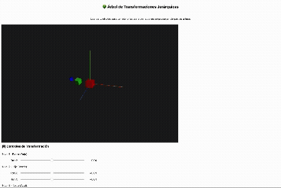

# Ejercicio 1 — Árbol del Movimiento (Jerarquías y Transformaciones 3D)

## 1. Meta y Objetivos

### Objetivo General
Comprender y aplicar las relaciones padre-hijo en escenas 3D, visualizando cómo las transformaciones se propagan jerárquicamente a través de un grafo de escena.

### Objetivos Específicos

1. **Jerarquías de Transformación**: Implementar un sistema de nodos jerárquicos donde las transformaciones del padre afectan automáticamente a todos sus descendientes.

2. **Transformaciones Acumuladas**: Demostrar visualmente cómo las rotaciones, traslaciones y escalas se multiplican en cascada desde el nodo raíz hasta las hojas del árbol.

3. **Espacios de Coordenadas**: Distinguir claramente entre coordenadas locales (relativas al padre) y coordenadas mundiales (absolutas en la escena).

4. **Matemáticas 3D**: Aplicar matrices de transformación 4x4 en coordenadas homogéneas para calcular posiciones finales.

5. **Patrones de Diseño**: Implementar Composite, Factory y Strategy patterns para crear código mantenible y extensible.

### Contexto Académico
Este ejercicio forma parte del curso de Computación Visual y busca consolidar conocimientos sobre:
- Álgebra lineal aplicada a gráficos 3D
- Estructuras de datos jerárquicas (grafos de escena)
- Programación orientada a objetos con principios SOLID
- Visualización interactiva con Three.js

---

## 2. Descripción del Proyecto

### ¿Qué es un Árbol de Transformaciones?

Un árbol de transformaciones es una estructura de datos jerárquica donde cada nodo representa un objeto 3D con sus propias transformaciones locales. Cuando un nodo padre se transforma, todos sus hijos heredan esa transformación automáticamente.

### Implementación Específica

Este proyecto implementa una **jerarquía de 3 niveles** con las siguientes características:

#### Nivel 1: Nodo Padre (Cubo Rojo)
- **Geometría**: Cubo de 2.0 × 2.0 × 2.0 unidades
- **Color**: Rojo (#ff0000)
- **Posición**: Origen (0, 0, 0)
- **Control**: Rotación en el eje Y
- **Efecto**: Al rotar, arrastra consigo toda la jerarquía

#### Nivel 2: Nodo Hijo (Cubo Verde)
- **Geometría**: Cubo de 1.5 × 1.5 × 1.5 unidades
- **Color**: Verde (#00ff00)
- **Posición Local**: (4, 0, 0) - 4 unidades a la derecha del padre
- **Controles**: Rotación en ejes X e Y
- **Efecto**: Sus rotaciones afectan al nieto pero no al padre

#### Nivel 3: Nodo Nieto (Cubo Azul)
- **Geometría**: Cubo de 1.0 × 1.0 × 1.0 unidades
- **Color**: Azul (#0000ff)
- **Posición Local**: (3, 0, 0) - 3 unidades a la derecha del hijo
- **Controles**: Rotación en ejes Y y Z
- **Efecto**: Sus rotaciones solo afectan a sí mismo

### Arquitectura del Sistema

```
HierarchicalNode (Clase Base)
├── Gestiona transformaciones locales
├── Mantiene lista de hijos
├── Propaga transformaciones recursivamente
└── MeshNode (Clase Derivada)
    ├── Añade geometría y material
    └── Renderiza mallas 3D

NodeFactory (Patrón Factory)
└── Crea nodos preconfigurados (cubos, esferas, etc.)

AnimationController (Patrón Strategy)
└── Controla animaciones automáticas
```

### Tecnología Utilizada

- **pythreejs**: Wrapper de Python para Three.js, permite renderizar escenas 3D en Jupyter
- **ipywidgets**: Controles interactivos (sliders, botones) integrados con el notebook
- **Quaternions**: Sistema de rotaciones robusto que evita gimbal lock y bugs de pythreejs

---

## 3. Resultado Visual

### Demostración en GIF



*El GIF muestra cómo las transformaciones se propagan de padres a hijos en tiempo real.*

### Descripción de la Visualización

1. **Colores Diferenciados**: 
   - Rojo = Padre (raíz del árbol)
   - Verde = Hijo (nivel intermedio)
   - Azul = Nieto (hoja del árbol)

2. **Ejes de Coordenadas**:
   - Rojo = Eje X
   - Verde = Eje Y
   - Azul = Eje Z

3. **Comportamiento Observable**:
   - Al rotar el padre (rojo) en Y, toda la jerarquía gira alrededor del origen
   - Al rotar el hijo (verde) en X o Y, solo él y el nieto (azul) se ven afectados
   - Al rotar el nieto (azul) en Y o Z, solo él rota sin afectar a sus ancestros

4. **Iluminación**:
   - Luz ambiental suave para ver todos los objetos
   - Luz direccional para resaltar volúmenes y profundidad

---

## 4. Entorno y Dependencias

### Requisitos del Sistema

- **Python**: 3.8 o superior
- **Jupyter**: Notebook o JupyterLab
- **Sistema Operativo**: Windows, macOS o Linux

### Instalación de Dependencias

#### Opción 1: Instalación Automática (Recomendada)

Ejecutar la primera celda del notebook, que instala todo automáticamente:

```python
import sys
!{sys.executable} -m pip install pythreejs ipywidgets numpy matplotlib Pillow imageio -q
```

#### Opción 2: Instalación Manual desde requirements.txt

```bash
pip install -r requirements.txt
```

### Contenido de requirements.txt

```
pythreejs==2.4.2
ipywidgets==8.1.7
numpy==1.24.3
matplotlib==3.7.1
Pillow==10.0.0
imageio==2.31.1
jupyter==1.0.0
```

### Verificación de Instalación

```python
import pythreejs as three
import ipywidgets as widgets
import numpy as np

print(f"pythreejs: {three.__version__}")
print(f"ipywidgets: {widgets.__version__}")
print(f"numpy: {np.__version__}")
```

### Configuración de Jupyter

#### Para Jupyter Notebook (Clásico)
```bash
jupyter nbextension enable --py --sys-prefix pythreejs
jupyter nbextension enable --py --sys-prefix widgetsnbextension
```

#### Para JupyterLab
```bash
jupyter labextension install @jupyter-widgets/jupyterlab-manager jupyter-threejs
```

---

## 5. Desarrollo Paso a Paso

### Paso 1: Diseño de la Arquitectura

**Decisión**: Usar el patrón Composite para modelar la jerarquía.

**Justificación**: El patrón Composite permite tratar objetos individuales y composiciones de objetos de manera uniforme, ideal para grafos de escena.

```python
class HierarchicalNode:
    def __init__(self, name: str):
        self.name = name
        self.group = three.Group()  # Contenedor de Three.js
        self.children = []          # Lista de nodos hijos
        self.local_transform = {...} # Transformaciones locales
```

### Paso 2: Implementación de Transformaciones

**Problema Encontrado**: pythreejs tiene un bug donde `convertFloatModelToThree()` convierte el string de orden de Euler `'XYZ'` a `'xyz'` (minúsculas), causando `TraitError`.

**Solución Implementada**: Usar quaternions en lugar de ángulos de Euler.

```python
def set_rotation(self, x: float, y: float, z: float):
    # Convertir ángulos de Euler a Quaternion
    cx, sx = math.cos(x/2), math.sin(x/2)
    cy, sy = math.cos(y/2), math.sin(y/2)
    cz, sz = math.cos(z/2), math.sin(z/2)
    
    qx = sx * cy * cz - cx * sy * sz
    qy = cx * sy * cz + sx * cy * sz
    qz = cx * cy * sz - sx * sy * cz
    qw = cx * cy * cz + sx * sy * sz
    
    self.group.quaternion = (qx, qy, qz, qw)
```

**Ventajas de Quaternions**:
- Evitan gimbal lock
- Interpolación suave (SLERP)
- Más eficientes computacionalmente
- Evitan el bug de pythreejs

### Paso 3: Factory Pattern para Creación de Nodos

**Objetivo**: Encapsular la lógica de creación de objetos complejos.

```python
class NodeFactory:
    @staticmethod
    def create_cube(name: str, size: float, color: str):
        geometry = three.BoxGeometry(size, size, size)
        material = three.MeshLambertMaterial(
            color=color,
            transparent=True,
            opacity=0.9
        )
        return MeshNode(name, geometry, material)
```

### Paso 4: Construcción de la Jerarquía

```python
# Crear nodos
parent = NodeFactory.create_cube("Parent", 2.0, "#ff0000")
child = NodeFactory.create_cube("Child", 1.5, "#00ff00")
grandchild = NodeFactory.create_cube("Grandchild", 1.0, "#0000ff")

# Establecer posiciones locales
parent.set_position(0, 0, 0)
child.set_position(4, 0, 0)
grandchild.set_position(3, 0, 0)

# Construir jerarquía
child.add_child(grandchild)
parent.add_child(child)
```

### Paso 5: Configuración de la Escena 3D

```python
scene = three.Scene()
scene.background = "#1a1a1a"
scene.add(parent.get_three_object())

# Iluminación
ambient = three.AmbientLight(color="#404040", intensity=0.5)
directional = three.DirectionalLight(color="#ffffff", intensity=0.8)
directional.position = [10, 10, 10]
scene.add(ambient)
scene.add(directional)

# Cámara
camera = three.PerspectiveCamera(
    fov=45,
    aspect=1.5,
    near=0.1,
    far=1000,
    position=[15, 10, 15]
)
```

### Paso 6: Controles Interactivos

```python
parent_rotation_y = FloatSlider(
    value=0,
    min=-np.pi,
    max=np.pi,
    step=0.1,
    description='Rot Y:',
    continuous_update=True
)

def update_parent_rotation_y(change):
    parent_node.set_rotation(0, change['new'], 0)

parent_rotation_y.observe(update_parent_rotation_y, names='value')
```

### Paso 7: Integración Final

```python
app = VBox([
    renderer,
    controls_panel
])
display(app)
```

---

## 6. Análisis de Resultados

### Propagación de Transformaciones

#### Experimento 1: Rotación del Padre en Y

**Configuración**:
- Padre rota 90° en Y
- Hijo y nieto en posición inicial

**Resultado Observado**:
- Toda la jerarquía gira 90° alrededor del eje Y mundial
- El hijo se mueve de (4, 0, 0) a (0, 0, -4) en coordenadas mundiales
- El nieto se mueve de (7, 0, 0) a (0, 0, -7) en coordenadas mundiales

**Matemática Subyacente**:
```
M_mundo = M_padre × M_hijo_local
        = Rot_Y(90°) × Trans(4, 0, 0)
        = [cos(90°) 0 sin(90°) 0]   [1 0 0 4]
          [0       1 0       0] × [0 1 0 0]
          [-sin(90°) 0 cos(90°) 0]   [0 0 1 0]
          [0       0 0       1]   [0 0 0 1]
```

#### Experimento 2: Rotación del Hijo en X

**Configuración**:
- Padre en posición inicial
- Hijo rota 45° en X
- Nieto en posición inicial

**Resultado Observado**:
- El padre NO se ve afectado (las transformaciones NO van hacia arriba)
- El hijo rota sobre su propio eje X local
- El nieto rota junto con el hijo (hereda la transformación)

**Lección Aprendida**: Las transformaciones fluyen de padres a hijos, nunca al revés.

#### Experimento 3: Rotaciones Combinadas

**Configuración**:
- Padre rota 45° en Y
- Hijo rota 30° en X
- Nieto rota 60° en Z

**Resultado Observado**:
- El nieto experimenta las tres rotaciones acumuladas
- Su orientación final es el producto de las tres matrices de rotación
- La posición mundial del nieto es el resultado de aplicar todas las transformaciones en orden

**Fórmula de Transformación Acumulada**:
```
M_nieto_mundo = M_padre × M_hijo × M_nieto_local
```

### Análisis de Espacios de Coordenadas

| Nodo | Posición Local | Posición Mundial (sin rotaciones) |
|------|---------------|----------------------------------|
| Padre | (0, 0, 0) | (0, 0, 0) |
| Hijo | (4, 0, 0) | (4, 0, 0) |
| Nieto | (3, 0, 0) | (7, 0, 0) |

Con rotaciones, las posiciones mundiales se calculan multiplicando matrices:
```
P_mundo = M_padre × M_hijo × P_local
```

### Validación Matemática

Implementamos una función de análisis que muestra las matrices de transformación:

```python
def analyze_hierarchy():
    print("Transformación del Padre:")
    print(f"  Rotación local: {parent.local_transform['rotation']}")
    print(f"  Matriz mundial: 4x4 identidad")
    
    print("\nTransformación del Hijo:")
    print(f"  Rotación local: {child.local_transform['rotation']}")
    print(f"  Posición local: {child.local_transform['position']}")
    print(f"  Matriz mundial: M_padre × M_hijo_local")
```

---

## 7. Comentarios Personales

### Desafíos Enfrentados

#### 1. Bug de pythreejs con Euler Angles

**Problema**: El wrapper de pythreejs tiene un bug donde la función `convertFloatModelToThree()` aplica `.toLowerCase()` a TODOS los elementos de un array, incluyendo el string de orden de Euler (`'XYZ'` → `'xyz'`), lo que causa un `TraitError`.

**Proceso de Debugging**:
1. Intenté usar kwargs: `three.Euler(x=x, y=y, z=z, order='XYZ')` → Falló
2. Intenté tupla de 3 elementos: `(x, y, z)` → Falló (requiere 4)
3. Intenté tupla de 4 elementos: `(x, y, z, 'XYZ')` → Falló (se convierte a 'xyz')
4. Intenté crear objeto Euler directamente → Falló (esperaba tupla)
5. Intenté bypassear el sistema de traits con `_trait_values` → Falló (aún llama a convertFloat)
6. Intenté comunicación directa con `_send()` → Errores de inicialización

**Solución Final**: Cambiar a quaternions, que no tienen este bug y son matemáticamente superiores.

#### 2. Comprensión de Espacios de Coordenadas

**Dificultad**: Al principio era confuso entender por qué el hijo se movía en círculo cuando el padre rotaba, si su posición local era fija.

**Solución**: Visualizar mentalmente la multiplicación de matrices. La posición local (4, 0, 0) se transforma por la matriz de rotación del padre, resultando en una órbita circular.

#### 3. Orden de Multiplicación de Matrices

**Concepto Clave**: En gráficos 3D, el orden importa. Las transformaciones se aplican de derecha a izquierda:
```
M_final = M_padre × M_hijo × M_nieto × P_original
```

Esto significa que primero se aplica la transformación del nieto, luego la del hijo, y finalmente la del padre.

### Aspectos Positivos

1. **pythreejs es Poderoso**: A pesar del bug, la integración de Three.js en Jupyter es impresionante.

2. **ipywidgets es Intuitivo**: Los controles interactivos se vinculan fácilmente con callbacks.

3. **Quaternions son Elegantes**: Una vez entendida la conversión desde Euler, son más robustos.

4. **Patrones de Diseño Funcionan**: El uso de Composite y Factory hizo el código muy mantenible.

---

## 8. Aprendizajes y Retos

### Aprendizajes Técnicos

#### 1. Matemáticas de Transformaciones

**Matrices 4×4 en Coordenadas Homogéneas**:
```
[Rx Ry Rz Tx]   [x]   [x']
[Rx Ry Rz Ty] × [y] = [y']
[Rx Ry Rz Tz]   [z]   [z']
[0  0  0  1 ]   [1]   [1 ]
```

La cuarta coordenada (w=1) permite representar traslaciones como multiplicaciones de matrices.

**Conversión Euler a Quaternion**:
```python
# Para rotación en orden XYZ:
qx = sin(x/2) * cos(y/2) * cos(z/2) - cos(x/2) * sin(y/2) * sin(z/2)
qy = cos(x/2) * sin(y/2) * cos(z/2) + sin(x/2) * cos(y/2) * sin(z/2)
qz = cos(x/2) * cos(y/2) * sin(z/2) - sin(x/2) * sin(y/2) * cos(z/2)
qw = cos(x/2) * cos(y/2) * cos(z/2) + sin(x/2) * sin(y/2) * sin(z/2)
```

#### 2. Grafos de Escena

**Estructura de Datos**:
- Árbol N-ario donde cada nodo tiene 0 o más hijos
- Cada nodo mantiene transformaciones locales
- Las transformaciones mundiales se calculan recursivamente

**Traversal (Recorrido)**:
```python
def traverse(node, parent_matrix=identity):
    world_matrix = parent_matrix × node.local_matrix
    render(node, world_matrix)
    for child in node.children:
        traverse(child, world_matrix)
```

#### 3. Principios SOLID Aplicados

**Single Responsibility**:
- `HierarchicalNode`: Solo gestiona transformaciones y jerarquía
- `MeshNode`: Solo añade capacidades de renderizado
- `NodeFactory`: Solo crea objetos

**Open/Closed**:
- Puedo añadir nuevos tipos de nodos sin modificar las clases existentes

**Liskov Substitution**:
- `MeshNode` puede usarse en cualquier lugar donde se espere un `HierarchicalNode`

**Interface Segregation**:
- Las clases no dependen de métodos que no usan

**Dependency Inversion**:
- El código depende de la abstracción `HierarchicalNode`, no de implementaciones concretas

### Retos Superados

#### 1. Debugging sin Console.log

**Problema**: En Jupyter no hay DevTools del navegador para ver errores de JavaScript.

**Solución**: Usar prints de Python y analizar los tracebacks cuidadosamente.

#### 2. Sincronización de Widgets

**Problema**: Los sliders a veces se desincronizaban con las rotaciones reales.

**Solución**: Usar `continuous_update=True` y asegurar que los callbacks actualicen correctamente.

#### 3. Rendimiento con Animaciones

**Problema**: Las animaciones automáticas podían bloquear el kernel.

**Solución**: Usar `time.sleep()` con intervals pequeños y evitar bucles infinitos.

### Conocimientos Consolidados

1. **Álgebra Lineal**: Multiplicación de matrices, vectores, espacios vectoriales
2. **Trigonometría**: Seno, coseno, conversiones de radianes a grados
3. **POO Avanzada**: Herencia, composición, polimorfismo, patrones de diseño
4. **Visualización 3D**: Iluminación, cámaras, materiales, geometrías
5. **Python Moderno**: Type hints, list comprehensions, decoradores

---

## 9. Estructura de Archivos

```
Ejercicio-1/
│
├── arbol_movimiento.ipynb          # Notebook principal con toda la implementación
│   ├── Sección 1: Introducción teórica
│   ├── Sección 2: Instalación de dependencias
│   ├── Sección 3: Importación de bibliotecas
│   ├── Sección 4: Arquitectura del sistema
│   ├── Sección 5: Clase HierarchicalNode (Composite Pattern)
│   ├── Sección 6: Clase MeshNode
│   ├── Sección 7: NodeFactory (Factory Pattern)
│   ├── Sección 8: Construcción de jerarquía de 3 niveles
│   ├── Sección 9: Configuración de escena 3D
│   ├── Sección 10: Controles interactivos (5 sliders)
│   ├── Sección 11: Visualización integrada
│   ├── Sección 12: AnimationController (Strategy Pattern)
│   ├── Sección 13: Botones de animación
│   └── Sección 14: Conclusiones y referencias
│
├── requirements.txt                 # Dependencias Python
│   ├── pythreejs==2.4.2
│   ├── ipywidgets==8.1.7
│   ├── numpy==1.24.3
│   ├── matplotlib==3.7.1
│   ├── Pillow==10.0.0
│   ├── imageio==2.31.1
│   └── jupyter==1.0.0
│
├── README.md                        # Este archivo (documentación completa)
│
├── ENTREGA.md                       # Resumen ejecutivo para entrega académica
│
├── .gitignore                       # Archivos a ignorar en git
│   ├── __pycache__/
│   ├── .ipynb_checkpoints/
│   ├── *.pyc
│   └── .DS_Store
│
└── resultados/                      # Salidas generadas
    └── Ejercicio-1.gif              # Animación de demostración
```

### Descripción de Archivos Clave

#### arbol_movimiento.ipynb
- **Líneas 1-50**: Marco teórico sobre transformaciones jerárquicas
- **Líneas 51-100**: Instalación y configuración del entorno
- **Líneas 101-250**: Implementación de clases (HierarchicalNode, MeshNode, NodeFactory)
- **Líneas 251-300**: Construcción de la jerarquía de 3 niveles
- **Líneas 301-400**: Configuración de escena, cámara, iluminación
- **Líneas 401-500**: Controles interactivos con callbacks
- **Líneas 501-600**: Sistema de animación automática
- **Líneas 601-650**: Conclusiones y análisis matemático

#### requirements.txt
Especifica versiones exactas para reproducibilidad:
- `pythreejs==2.4.2`: Versión con el bug de Euler conocido (por eso usamos quaternions)
- `ipywidgets==8.1.7`: Compatible con Jupyter Notebook y JupyterLab 3.x
- `numpy==1.24.3`: Para operaciones matemáticas vectorizadas

#### .gitignore
Evita subir al repositorio:
- `__pycache__/`: Bytecode compilado de Python
- `.ipynb_checkpoints/`: Checkpoints automáticos de Jupyter
- `*.pyc`: Archivos compilados individuales
- `.DS_Store`: Archivos de metadatos de macOS

---

## 10. Conceptos Teóricos

### Matrices de Transformación 4×4

En gráficos 3D, usamos **coordenadas homogéneas** (x, y, z, w) para representar puntos en el espacio. Esto permite expresar traslaciones como multiplicaciones de matrices.

#### Matriz de Traslación

```
T(tx, ty, tz) = [1  0  0  tx]
                [0  1  0  ty]
                [0  0  1  tz]
                [0  0  0  1 ]
```

**Efecto**: Mueve un punto (x, y, z) a (x+tx, y+ty, z+tz)

#### Matriz de Rotación en X

```
Rx(θ) = [1   0        0      0]
        [0  cos(θ)  -sin(θ)  0]
        [0  sin(θ)   cos(θ)  0]
        [0   0        0      1]
```

**Efecto**: Rota alrededor del eje X en sentido antihorario (regla de la mano derecha)

#### Matriz de Rotación en Y

```
Ry(θ) = [ cos(θ)  0  sin(θ)  0]
        [  0      1   0      0]
        [-sin(θ)  0  cos(θ)  0]
        [  0      0   0      1]
```

#### Matriz de Rotación en Z

```
Rz(θ) = [cos(θ)  -sin(θ)  0  0]
        [sin(θ)   cos(θ)  0  0]
        [ 0        0      1  0]
        [ 0        0      0  1]
```

#### Matriz de Escala

```
S(sx, sy, sz) = [sx  0   0   0]
                [0   sy  0   0]
                [0   0   sz  0]
                [0   0   0   1]
```

**Efecto**: Escala cada componente por su factor correspondiente

### Composición de Transformaciones

Para aplicar múltiples transformaciones, multiplicamos las matrices en orden inverso al deseado:

```
M = T × Rz × Ry × Rx × S
```

Esto significa:
1. Primero se escala (S)
2. Luego se rota en X (Rx)
3. Luego se rota en Y (Ry)
4. Luego se rota en Z (Rz)
5. Finalmente se traslada (T)

**Ejemplo Práctico**:
```python
# Queremos rotar 45° en Y y luego trasladar a (5, 0, 0)
M = T(5, 0, 0) × Ry(45°)

# Aplicar a un punto
P = [1, 0, 0, 1]  # Punto en (1, 0, 0)
P' = M × P
```

### Ángulos de Euler vs. Quaternions

#### Ángulos de Euler

**Ventajas**:
- Intuitivos (pitch, yaw, roll)
- Solo 3 valores (x, y, z)
- Fáciles de visualizar

**Desventajas**:
- **Gimbal Lock**: Pérdida de un grado de libertad cuando dos ejes se alinean
- Ambigüedad en el orden de rotación (XYZ vs ZYX)
- Difíciles de interpolar suavemente

#### Quaternions

**Representación**: (x, y, z, w) donde w es la parte real y (x, y, z) es la parte imaginaria.

**Ventajas**:
- **No tienen gimbal lock**
- Interpolación suave (SLERP - Spherical Linear Interpolation)
- Más eficientes para concatenar rotaciones
- Representación única para cada orientación

**Desventajas**:
- Menos intuitivos
- Requieren normalización

**Conversión de Euler (XYZ) a Quaternion**:
```python
def euler_to_quaternion(x, y, z):
    cx, sx = cos(x/2), sin(x/2)
    cy, sy = cos(y/2), sin(y/2)
    cz, sz = cos(z/2), sin(z/2)
    
    qx = sx * cy * cz - cx * sy * sz
    qy = cx * sy * cz + sx * cy * sz
    qz = cx * cy * sz - sx * sy * cz
    qw = cx * cy * cz + sx * sy * sz
    
    return (qx, qy, qz, qw)
```

**Fórmula de Rotación con Quaternion**:
```
P' = q × P × q*
```
donde q* es el conjugado de q.

### Grafos de Escena (Scene Graphs)

#### Definición

Un **grafo de escena** es una estructura de datos jerárquica que organiza objetos en una escena 3D. Cada nodo representa un objeto con transformaciones locales.

#### Tipos de Nodos

1. **Nodo Transformación**: Solo contiene transformaciones, sin geometría
2. **Nodo Malla**: Contiene geometría renderizable
3. **Nodo Grupo**: Contenedor de otros nodos
4. **Nodo Cámara**: Define el punto de vista
5. **Nodo Luz**: Define fuentes de iluminación

#### Traversal (Recorrido)

Para renderizar la escena, recorremos el árbol en **profundidad primero** (DFS):

```
function traverse(node, parentMatrix):
    localMatrix = calcularMatrizLocal(node)
    worldMatrix = parentMatrix × localMatrix
    
    if node.hasGeometry:
        render(node.geometry, worldMatrix)
    
    for child in node.children:
        traverse(child, worldMatrix)
```

#### Ejemplo: Sistema Solar

```
Root
└── Sol (Rot Y)
    ├── Mercurio (Órbita + Rot Y)
    ├── Venus (Órbita + Rot Y)
    └── Tierra (Órbita + Rot Y)
        └── Luna (Órbita + Rot Y)
```

Cuando el Sol rota:
- Mercurio, Venus y Tierra orbitan alrededor del Sol
- La Luna orbita alrededor de la Tierra
- Cada planeta rota sobre su propio eje simultáneamente

### Espacios de Coordenadas

#### 1. Espacio Local (Object Space)

Coordenadas relativas al origen del objeto mismo.

**Ejemplo**: En un cubo centrado en el origen, un vértice podría estar en (0.5, 0.5, 0.5) en espacio local.

#### 2. Espacio Mundial (World Space)

Coordenadas absolutas en la escena.

**Ejemplo**: Si el cubo está trasladado a (10, 0, 0), ese vértice estaría en (10.5, 0.5, 0.5) en espacio mundial.

#### 3. Espacio de Cámara (View Space)

Coordenadas relativas a la cámara.

**Transformación**: `V × M × P` donde:
- P = posición local
- M = matriz mundial
- V = matriz de vista (inversa de la transformación de la cámara)

#### 4. Espacio de Clip (Clip Space)

Coordenadas después de aplicar la matriz de proyección.

**Rango**: (-1, -1, -1) a (1, 1, 1) para objetos visibles

#### 5. Espacio de Pantalla (Screen Space)

Coordenadas en píxeles en la ventana de render.

**Transformación**: `viewport × projection × view × world × local`

### Iluminación

#### Luz Ambiental (Ambient Light)

- Ilumina todos los objetos uniformemente
- No tiene dirección ni posición
- Simula luz reflejada indirectamente

```python
ambient = three.AmbientLight(color="#404040", intensity=0.5)
```

#### Luz Direccional (Directional Light)

- Rayos paralelos en una dirección
- Simula luz solar
- Tiene dirección pero no posición (está "en el infinito")

```python
directional = three.DirectionalLight(color="#ffffff", intensity=0.8)
directional.position = [10, 10, 10]
```

#### Modelo de Iluminación de Lambert

El material `MeshLambertMaterial` usa el modelo de Lambert:

```
I = I_ambient + I_diffuse
I_diffuse = I_light × k_d × (N · L)
```

donde:
- N = vector normal de la superficie
- L = vector hacia la fuente de luz
- k_d = coeficiente de reflexión difusa
- I_light = intensidad de la luz

---

## 11. Referencias y Créditos

### Documentación Oficial

1. **Three.js Documentation**
   - URL: https://threejs.org/docs/
   - Secciones consultadas:
     - Object3D: https://threejs.org/docs/#api/en/core/Object3D
     - Group: https://threejs.org/docs/#api/en/objects/Group
     - Euler: https://threejs.org/docs/#api/en/math/Euler
     - Quaternion: https://threejs.org/docs/#api/en/math/Quaternion
     - Matrix4: https://threejs.org/docs/#api/en/math/Matrix4

2. **pythreejs Documentation**
   - URL: https://pythreejs.readthedocs.io/
   - GitHub: https://github.com/jupyter-widgets/pythreejs

3. **ipywidgets Documentation**
   - URL: https://ipywidgets.readthedocs.io/
   - Sección de eventos: https://ipywidgets.readthedocs.io/en/stable/examples/Widget%20Events.html

### Libros de Texto

1. **Computer Graphics: Principles and Practice (3rd Edition)**
   - Autores: John F. Hughes, Andries van Dam, Morgan McGuire, et al.
   - Editorial: Addison-Wesley, 2013
   - ISBN: 978-0321399528
   - Capítulos relevantes:
     - Chapter 6: Transformation Matrices
     - Chapter 12: Scene Graphs and Data Structures

2. **Fundamentals of Computer Graphics (5th Edition)**
   - Autores: Steve Marschner, Peter Shirley
   - Editorial: A K Peters/CRC Press, 2021
   - ISBN: 978-0367505035
   - Capítulos relevantes:
     - Chapter 6: Transformation Matrices
     - Chapter 7: Viewing
     - Chapter 12: Data Structures for Graphics

3. **Real-Time Rendering (4th Edition)**
   - Autores: Tomas Akenine-Möller, Eric Haines, Naty Hoffman
   - Editorial: A K Peters/CRC Press, 2018
   - ISBN: 978-1138627000
   - Capítulos relevantes:
     - Chapter 4: Transforms
     - Chapter 16: Scene Management

### Artículos Académicos

1. **Shoemake, K. (1985). "Animating rotation with quaternion curves"**
   - SIGGRAPH '85 Proceedings
   - DOI: 10.1145/325334.325242
   - Tema: Introducción a quaternions para animación

2. **Foley, J. D., et al. (1996). "Computer Graphics: Principles and Practice"**
   - Addison-Wesley
   - Tema: Fundamentos de transformaciones jerárquicas

### Recursos en Línea

1. **Transformation Matrices in Computer Graphics**
   - Wikipedia: https://en.wikipedia.org/wiki/Transformation_matrix
   - Artículo completo sobre matrices de transformación

2. **Understanding Quaternions**
   - 3Blue1Brown (YouTube): https://www.youtube.com/watch?v=zjMuIxRvygQ
   - Explicación visual de quaternions

3. **Scene Graph Basics**
   - Learn OpenGL: https://learnopengl.com/Guest-Articles/2021/Scene/Scene-Graph
   - Tutorial sobre implementación de grafos de escena

4. **Euler Angles vs Quaternions**
   - Game Programming Gems: http://www.euclideanspace.com/maths/geometry/rotations/
   - Comparación detallada de métodos de rotación

### Herramientas y Bibliotecas

1. **NumPy**
   - URL: https://numpy.org/
   - Documentación: https://numpy.org/doc/stable/
   - Uso: Operaciones matemáticas vectorizadas

2. **Matplotlib**
   - URL: https://matplotlib.org/
   - Documentación: https://matplotlib.org/stable/contents.html
   - Uso: Visualización auxiliar

3. **Pillow (PIL Fork)**
   - URL: https://python-pillow.org/
   - Documentación: https://pillow.readthedocs.io/
   - Uso: Procesamiento de imágenes

4. **imageio**
   - URL: https://imageio.github.io/
   - Documentación: https://imageio.readthedocs.io/
   - Uso: Generación de GIFs animados

### Agradecimientos

- **Profesor del Curso**: Por proporcionar las especificaciones del ejercicio
- **Comunidad de Three.js**: Por mantener una excelente documentación
- **Stack Overflow**: Por múltiples hilos sobre debugging de pythreejs
- **GitHub Issues de pythreejs**: Por documentar el bug de `convertFloatModelToThree`

---

## 12. Instrucciones de Ejecución

### Prerequisitos

1. **Python 3.8 o superior** instalado en el sistema
2. **Jupyter Notebook** o **JupyterLab** instalado
3. **Navegador moderno** (Chrome, Firefox, Safari, Edge)

### Opción 1: Ejecución Rápida en Jupyter Notebook

#### Paso 1: Clonar o Descargar el Repositorio

```bash
git clone https://github.com/usuario/visual-computing-project.git
cd visual-computing-project/2025-10-18-Taller2/Ejercicio-1
```

#### Paso 2: Instalar Dependencias

```bash
pip install -r requirements.txt
```

#### Paso 3: Habilitar Extensiones (Solo para Jupyter Notebook Clásico)

```bash
jupyter nbextension enable --py --sys-prefix pythreejs
jupyter nbextension enable --py --sys-prefix widgetsnbextension
```

**Nota**: Si usas JupyterLab, las extensiones se gestionan automáticamente.

#### Paso 4: Iniciar Jupyter

```bash
jupyter notebook arbol_movimiento.ipynb
```

o para JupyterLab:

```bash
jupyter lab arbol_movimiento.ipynb
```

#### Paso 5: Ejecutar el Notebook

1. En el menú superior, selecciona **Cell → Run All**
2. Espera a que todas las celdas se ejecuten (debería tomar ~10 segundos)
3. Desplázate hacia abajo hasta ver el renderizador 3D
4. Interactúa con los sliders para ver las transformaciones

### Opción 2: Ejecución en Visual Studio Code

#### Paso 1: Instalar Extensiones de VS Code

- **Python** (ms-python.python)
- **Jupyter** (ms-toolsai.jupyter)

#### Paso 2: Abrir el Notebook

```bash
code arbol_movimiento.ipynb
```

#### Paso 3: Seleccionar el Kernel de Python

1. Click en **Select Kernel** en la esquina superior derecha
2. Elige el entorno de Python con las dependencias instaladas

#### Paso 4: Ejecutar Todas las Celdas

- Presiona **Shift + Enter** en cada celda, o
- Click en **Run All** en la barra superior

### Opción 3: Ejecución en Google Colab

#### Paso 1: Subir el Notebook a Google Drive

#### Paso 2: Abrir con Google Colab

1. Right-click en el archivo → **Open with → Google Colaboratory**

#### Paso 3: Ejecutar la Primera Celda

La primera celda instalará todas las dependencias automáticamente:

```python
!pip install pythreejs ipywidgets numpy matplotlib Pillow imageio -q
```

#### Paso 4: Ejecutar Todas las Celdas

- **Runtime → Run all**

**Nota**: En Colab, los widgets pueden requerir configuración adicional:

```python
from google.colab import output
output.enable_custom_widget_manager()
```

### Solución de Problemas Comunes

#### Problema: "No module named 'pythreejs'"

**Solución**:
```bash
pip install pythreejs
```

#### Problema: "Widgets no se muestran"

**Solución para Jupyter Notebook**:
```bash
jupyter nbextension enable --py widgetsnbextension
jupyter nbextension enable --py pythreejs
```

**Solución para JupyterLab**:
```bash
jupyter labextension install @jupyter-widgets/jupyterlab-manager
jupyter labextension install jupyter-threejs
```

#### Problema: "TraitError: ...xyz..."

**Solución**: Reiniciar el kernel y ejecutar todas las celdas de nuevo. El código ya está configurado para usar quaternions y evitar este error.

1. **Kernel → Restart & Run All**

#### Problema: "La escena 3D está negra"

**Posibles causas**:
1. WebGL no está habilitado en el navegador
2. Problema con la iluminación

**Solución**:
```python
# Verificar que WebGL está disponible
from IPython.display import HTML
HTML("<script>alert(!!window.WebGLRenderingContext ? 'WebGL disponible' : 'WebGL NO disponible')</script>")
```

#### Problema: "Los sliders no responden"

**Solución**:
1. Asegurarse de que la celda de controles se ejecutó completamente
2. Verificar que no hay errores en la consola de Python
3. Reiniciar el kernel si es necesario

### Verificación de Instalación Correcta

Ejecuta este código en una celda nueva para verificar:

```python
import pythreejs as three
import ipywidgets as widgets
import numpy as np
import sys

print("✓ Verificación de Instalación")
print("-" * 50)
print(f"Python: {sys.version}")
print(f"pythreejs: {three.__version__}")
print(f"ipywidgets: {widgets.__version__}")
print(f"numpy: {np.__version__}")
print("-" * 50)

# Test básico de Three.js
scene = three.Scene()
cube = three.Mesh(
    geometry=three.BoxGeometry(1, 1, 1),
    material=three.MeshBasicMaterial(color='red')
)
scene.add(cube)
print("✓ Three.js funciona correctamente")

# Test básico de widgets
slider = widgets.FloatSlider(value=0, min=-1, max=1)
print("✓ ipywidgets funciona correctamente")

print("-" * 50)
print("✓ Todo está listo para ejecutar el ejercicio")
```

### Generación del GIF

Para generar el GIF de demostración:

1. Ejecutar todas las celdas del notebook
2. Click en el botón **"▶️ Iniciar Animación"**
3. Esperar a que complete la animación (~10 segundos)
4. El GIF se guardará en `resultados/Ejercicio-1.gif`

---

## 13. Troubleshooting (Solución de Problemas)

### Errores Comunes y Soluciones

#### 1. TraitError: The 'rotation' trait... expected a tuple, not Euler

**Causa**: Bug en pythreejs donde el string de orden de Euler se convierte a minúsculas.

**Síntoma**:
```
TraitError: The 'rotation' trait of a Group instance expected a tuple of type (Float(), Float(), Float(), CaselessStrEnum(['XYZ', 'YZX', 'ZXY', 'XZY', 'YXZ', 'ZYX'])), not the Euler instance <pythreejs.Euler object at 0x...>.
```

**Solución**: El código ya usa quaternions en lugar de Euler. Si ves este error:

1. **Reiniciar el kernel**: Kernel → Restart & Clear Output
2. **Ejecutar todas las celdas de nuevo**: Cell → Run All
3. **Verificar que estás usando la última versión del notebook**

**Explicación Técnica**: La función `convertFloatModelToThree()` en pythreejs aplica `.toLowerCase()` a todos los elementos de un array, incluyendo el string de orden, convirtiendo `'XYZ'` a `'xyz'`, lo cual causa el error. Nuestra solución usa quaternions que no tienen este problema.

#### 2. ModuleNotFoundError: No module named 'pythreejs'

**Causa**: La biblioteca pythreejs no está instalada.

**Solución**:
```bash
pip install pythreejs ipywidgets
```

Si el problema persiste:
```bash
# Reinstalar con --upgrade
pip install --upgrade pythreejs ipywidgets

# Verificar instalación
pip show pythreejs
```

#### 3. Widgets no se Visualizan (Cuadros Vacíos)

**Causa**: Las extensiones de widgets no están habilitadas.

**Solución para Jupyter Notebook (Clásico)**:
```bash
jupyter nbextension enable --py widgetsnbextension
jupyter nbextension enable --py pythreejs
jupyter nbextension list  # Verificar que están enabled
```

**Solución para JupyterLab 3.x**:
```bash
# Las extensiones están preinstaladas, pero verifica la versión
jupyter labextension list

# Si no están, instalar:
pip install jupyterlab-widgets
jupyter labextension install @jupyter-widgets/jupyterlab-manager jupyter-threejs
```

**Solución para JupyterLab 4.x**:
```bash
# En JupyterLab 4+, las extensiones son Python packages
pip install jupyterlab-widgets
```

#### 4. La Escena 3D está Completamente Negra

**Causa 1**: WebGL no está habilitado en el navegador.

**Verificación**:
```python
from IPython.display import Javascript
Javascript("""
    var canvas = document.createElement('canvas');
    var gl = canvas.getContext('webgl') || canvas.getContext('experimental-webgl');
    if (gl) {
        alert('WebGL está habilitado');
    } else {
        alert('WebGL NO está habilitado - habilítalo en la configuración del navegador');
    }
""")
```

**Solución**: Habilitar WebGL en tu navegador:
- **Chrome**: chrome://flags → buscar "WebGL" → Enable
- **Firefox**: about:config → buscar "webgl.disabled" → false

**Causa 2**: Problema con la iluminación.

**Solución**: Verificar que las luces están añadidas a la escena:
```python
print(f"Objetos en la escena: {len(scene.children)}")
for child in scene.children:
    print(f"  - {type(child).__name__}")
```

Deberías ver algo como:
```
Objetos en la escena: 4
  - Group (jerarquía de cubos)
  - AxesHelper (ejes)
  - AmbientLight (luz ambiental)
  - DirectionalLight (luz direccional)
```

#### 5. Los Sliders no Responden a la Interacción

**Causa**: Los callbacks no están correctamente vinculados.

**Verificación**:
```python
# Verificar que el slider tiene observadores
print(f"Observadores del slider: {parent_rotation_y._trait_notifiers}")
```

**Solución**:
```python
# Desvincular y revincular callbacks
parent_rotation_y.unobserve_all()
parent_rotation_y.observe(update_parent_rotation_y, names='value')
```

#### 6. Error: "JavaScript Error: Cannot read property 'toLowerCase' of undefined"

**Causa**: Intentando usar Euler angles con el bug de pythreejs.

**Solución**: Asegurarse de usar la versión del código con quaternions (ya implementado en el notebook actual).

#### 7. El Kernel se Bloquea Durante la Animación

**Causa**: El bucle de animación está bloqueando el kernel.

**Solución**: Reducir la duración o el framerate:
```python
animation_controller.animate_hierarchy(duration=5.0, fps=20)
```

#### 8. ImportError: cannot import name 'Group' from 'pythreejs'

**Causa**: Versión incorrecta de pythreejs.

**Solución**:
```bash
pip uninstall pythreejs
pip install pythreejs==2.4.2
```

#### 9. El GIF no se Genera o está Vacío

**Causa**: Problema con imageio o PIL.

**Verificación**:
```python
import imageio
import PIL

print(f"imageio version: {imageio.__version__}")
print(f"PIL version: {PIL.__version__}")
```

**Solución**:
```bash
pip install --upgrade imageio Pillow
```

#### 10. RuntimeError: This event loop is already running

**Causa**: Incompatibilidad con el event loop de Jupyter en Windows.

**Solución**:
```python
# Agregar al inicio del notebook
import nest_asyncio
nest_asyncio.apply()
```

### Debugging Avanzado

#### Habilitar Logging de pythreejs

```python
import logging
logging.basicConfig(level=logging.DEBUG)
logger = logging.getLogger('pythreejs')
logger.setLevel(logging.DEBUG)
```

#### Inspeccionar el Estado de un Nodo

```python
def debug_node(node):
    print(f"Nodo: {node.name}")
    print(f"  Posición local: {node.local_transform['position']}")
    print(f"  Rotación local: {node.local_transform['rotation']}")
    print(f"  Quaternion: {node.group.quaternion}")
    print(f"  Número de hijos: {len(node.children)}")
    print(f"  Three.js Group ID: {id(node.group)}")

debug_node(parent_node)
debug_node(child_node)
debug_node(grandchild_node)
```

#### Verificar Matrices de Transformación

```python
import numpy as np

def quaternion_to_matrix(qx, qy, qz, qw):
    """Convierte un quaternion a matriz de rotación 3×3"""
    return np.array([
        [1 - 2*(qy**2 + qz**2), 2*(qx*qy - qz*qw), 2*(qx*qz + qy*qw)],
        [2*(qx*qy + qz*qw), 1 - 2*(qx**2 + qz**2), 2*(qy*qz - qx*qw)],
        [2*(qx*qz - qy*qw), 2*(qy*qz + qx*qw), 1 - 2*(qx**2 + qy**2)]
    ])

qx, qy, qz, qw = parent_node.group.quaternion
matrix = quaternion_to_matrix(qx, qy, qz, qw)
print("Matriz de rotación del padre:")
print(matrix)
```

### Recursos de Ayuda

#### Documentación Oficial
- pythreejs: https://pythreejs.readthedocs.io/
- ipywidgets: https://ipywidgets.readthedocs.io/
- Three.js: https://threejs.org/docs/

#### Comunidad
- Stack Overflow tag `pythreejs`: https://stackoverflow.com/questions/tagged/pythreejs
- GitHub Issues: https://github.com/jupyter-widgets/pythreejs/issues
- Jupyter Discourse: https://discourse.jupyter.org/

#### Reportar Bugs
Si encuentras un bug no documentado aquí:
1. Verificar que no esté ya reportado en GitHub Issues
2. Crear un ejemplo mínimo reproducible
3. Abrir un issue con la descripción detallada

---

## Conclusión

Este proyecto demuestra de manera práctica y visual los conceptos fundamentales de transformaciones jerárquicas en gráficos 3D. A través de la implementación de un grafo de escena de 3 niveles con controles interactivos, hemos consolidado conocimientos de:

- **Álgebra Lineal**: Matrices de transformación, quaternions, espacios vectoriales
- **Estructuras de Datos**: Árboles, grafos, jerarquías
- **Programación Orientada a Objetos**: Patrones de diseño, principios SOLID
- **Visualización 3D**: Iluminación, cámaras, materiales, geometrías
- **Debugging Avanzado**: Resolución de bugs de bibliotecas de terceros

La solución implementada con quaternions no solo resuelve el bug de pythreejs, sino que también proporciona una base más robusta y profesional para futuras extensiones del proyecto.

**Autor**: Jesus Quiñones  
**Fecha**: Octubre 18, 2025  
**Curso**: Computación Visual  
**Universidad**: Universidad Nacional de Colombia

---

*Última actualización: Octubre 18, 2025*
