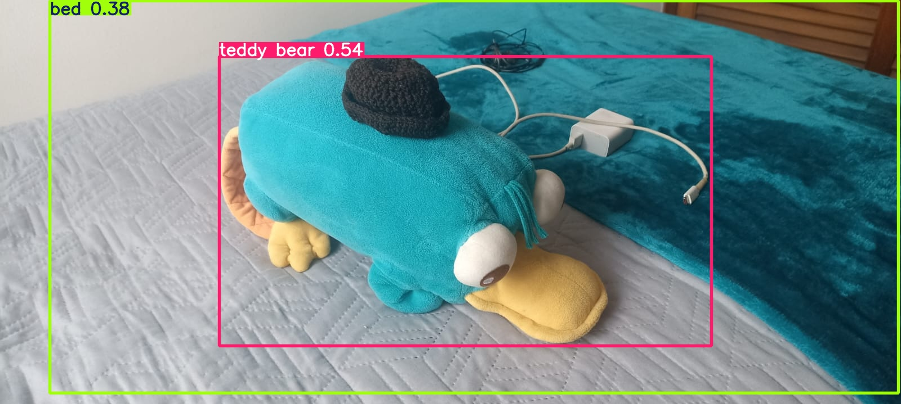
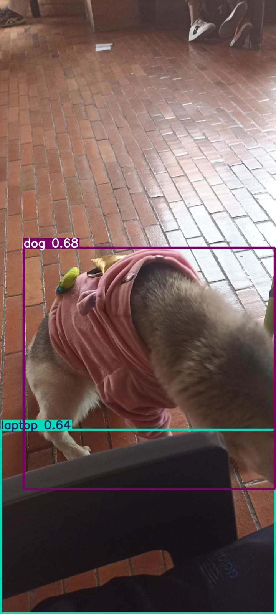
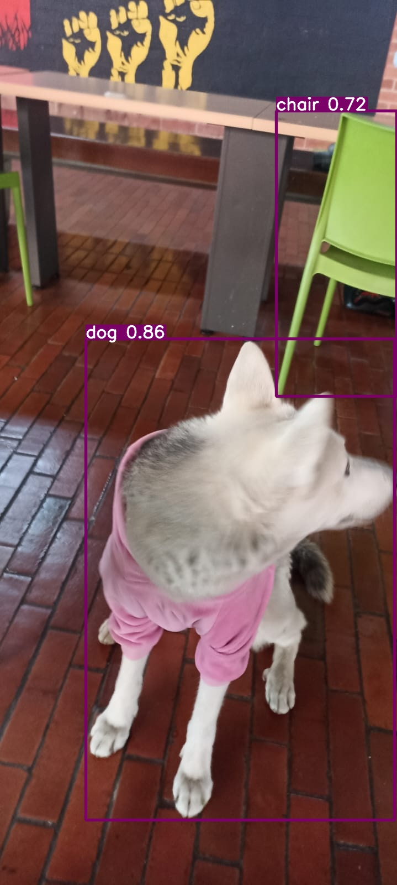

# 1. YOLO – Resultados de Detección

Este documento presenta las predicciones realizadas con **YOLO11 (Ultralytics)** sobre cinco imágenes capturadas para el laboratorio de detección base.
Cada figura incluye la imagen con bounding boxes, el análisis de confianza y el comportamiento observado del modelo.

---

## Figura 1 – Análisis

**Resumen del modelo:**

| Objeto Detectado | Confianza |
| :--- | :--- |
| `dining_table` | 0.57 |
| `fork` | 0.52 |
| `sandwich` | 0.32 |

**Análisis:**
El modelo identifica correctamente objetos como el tenedor (`fork`) y la mesa (`dining_table`). Sin embargo, presenta un claro error de clasificación al identificar la pieza de carne (chuleta) como un `sandwich`, y además con una confianza muy baja (0.32). También se observan falsos negativos, ya que ignora por completo la ensalada y el puré de papas.

---

## Figura 2 – Análisis

**Resumen del modelo:**

| Objeto Detectado | Confianza |
| :--- | :--- |
| `teddy bear` | 0.54 |
| `bed` | 0.38 |

**Análisis:**
El modelo vuelve a mostrar confusión de clases. Identifica correctamente el contexto (`bed`), aunque con baja confianza. El objeto principal, un peluche de Perry el Ornitorrinco, es erróneamente clasificado como un `teddy bear`, sin embargo puede que la clasificación solo detecte este tipo de objetos como peluches, conocidos generalmente en inglés como `teddy bears`. Falla en detectar objetos más pequeños como el cargador, el cable o el sombrero tejido sobre el peluche.

---

## Figura 3 – Análisis

**Resumen del modelo:**

| Objeto Detectado | Confianza |
| :--- | :--- |
| `dog` | 0.68 |
| `laptop` | 0.64 |

**Análisis:**
El modelo detecta exitosamente al perro (`dog`), a pesar de estar en un ángulo trasero y parcialmente obstruido. El fallo principal aquí es un **falso positivo** claro: detecta una silla como una `laptop` con una confianza relativamente alta de 0.64.

---

## Figura 4 – Análisis

**Resumen del modelo:**

| Objeto Detectado | Confianza |
| :--- | :--- |
| `dog` | 0.86 |
| `chair` | 0.72 |

**Análisis:**
Esta imagen muestra un buen rendimiento. El modelo identifica correctamente y con alta confianza a los dos sujetos principales: el perro (`dog` 0.86) y la silla verde (`chair` 0.72). Los bounding boxes son precisos y no hay detecciones erróneas.

---

## Figura 5 – Análisis

**Resumen del modelo:**

| Objeto Detectado | Confianza |
| :--- | :--- |
| `dog` | 0.88 |

**Análisis:**
Este es el mejor resultado del conjunto. El modelo detecta al perro con una confianza muy alta (0.88) y un bounding box bien ajustado. La iluminación es buena y el fondo (pared azul y escaleras) no genera ninguna confusión ni falso positivo.

---

## Failure Cases Identificados

### **Failure Case 1: Confusión de Clases (Clasificación Errónea)**

Se observa un patrón donde el modelo, al no reconocer un objeto específico, lo asigna a la clase más genérica y visualmente similar que conoce.
* **Ejemplo 1 (Figura 1):** La comida en el plato (carne) es clasificada como `sandwich`.
* **Ejemplo 2 (Figura 2):** El peluche de "Perry el Ornitorrinco" es clasificado como `teddy bear`.
Esto sugiere que el modelo carece de granularidad en sus clases para estos casos.

### **Failure Case 2: Falsos Positivos con Confianza Media**

El modelo genera detecciones incorrectas (falsos positivos) con puntuaciones de confianza que no son lo suficientemente bajas como para ser descartadas automáticamente.
* **Ejemplo (Figura 3):** Un objeto oscuro en primer plano es identificado como `laptop` con una confianza de 0.64. Esto es problemático, ya que un umbral de confianza estándar (como 0.5) no filtraría este error, introduciendo "ruido" en las detecciones.