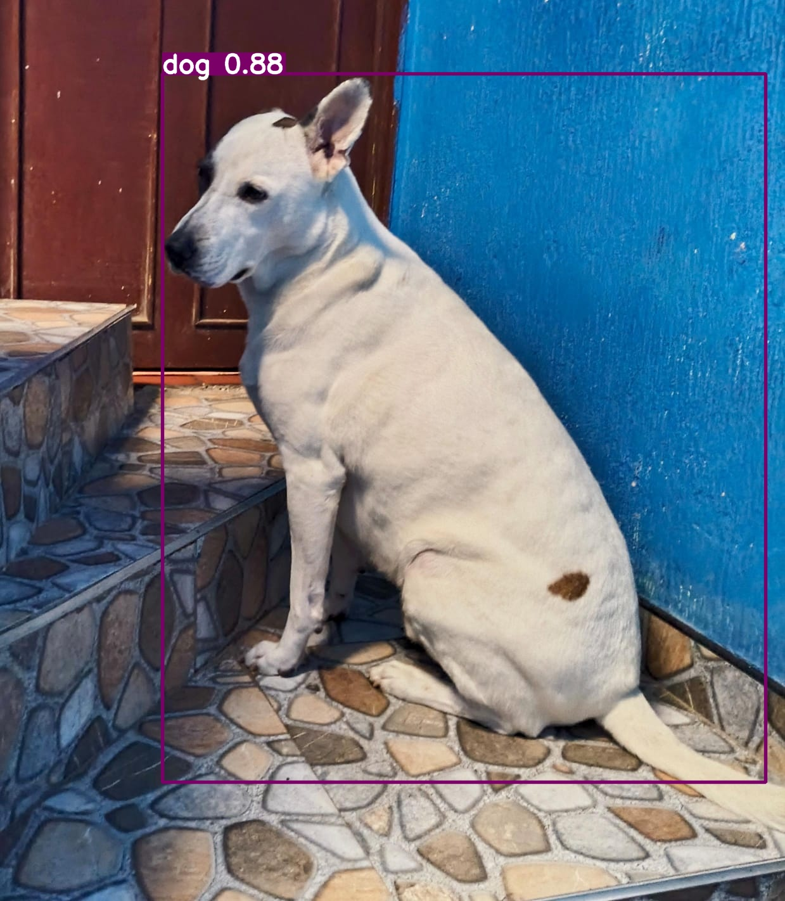
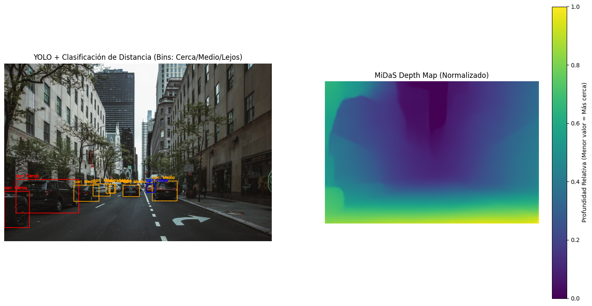
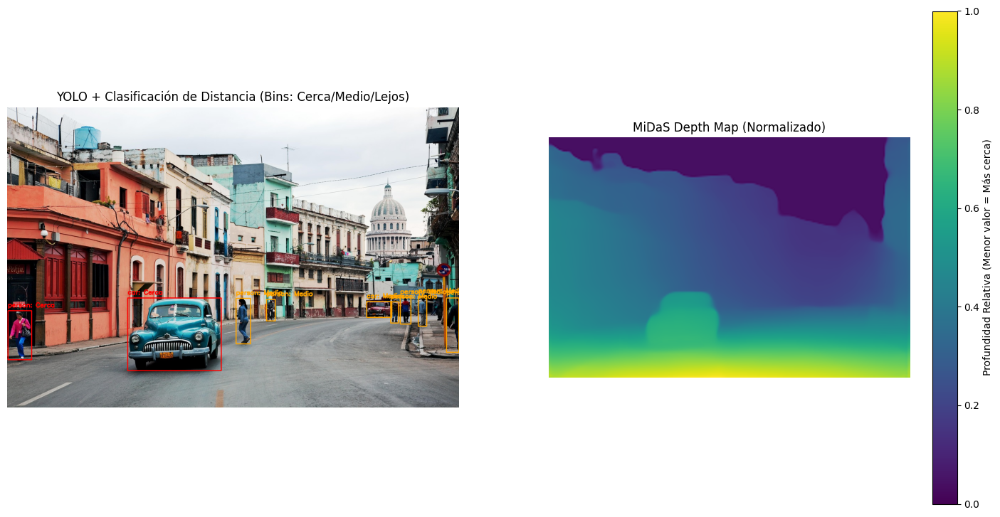
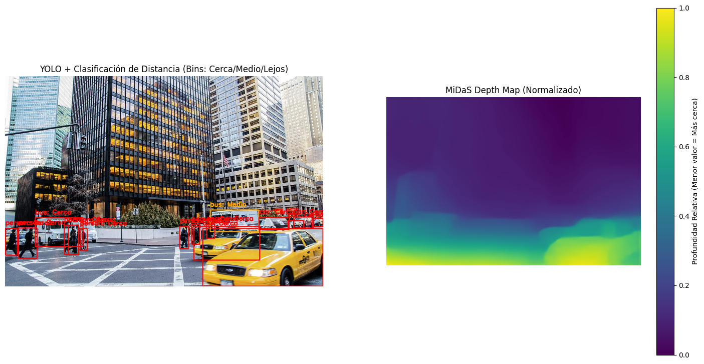
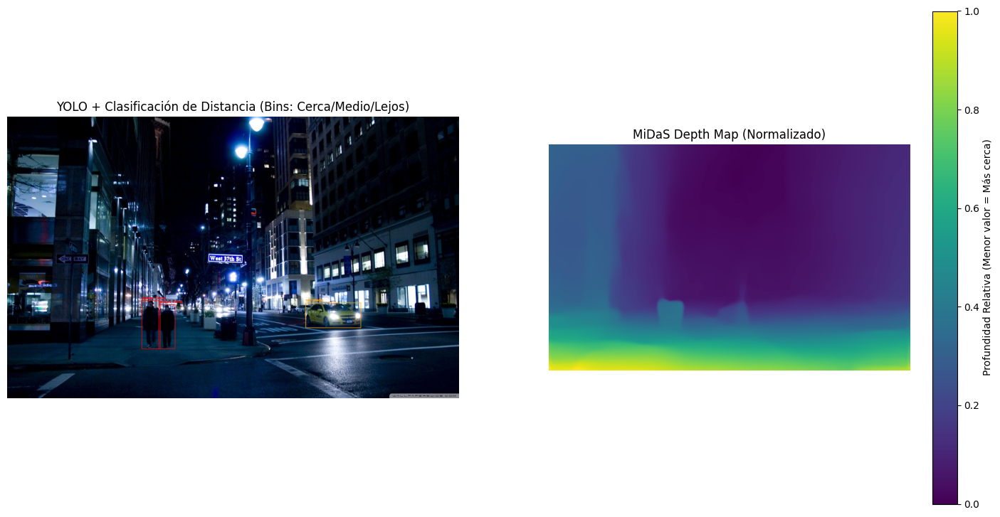
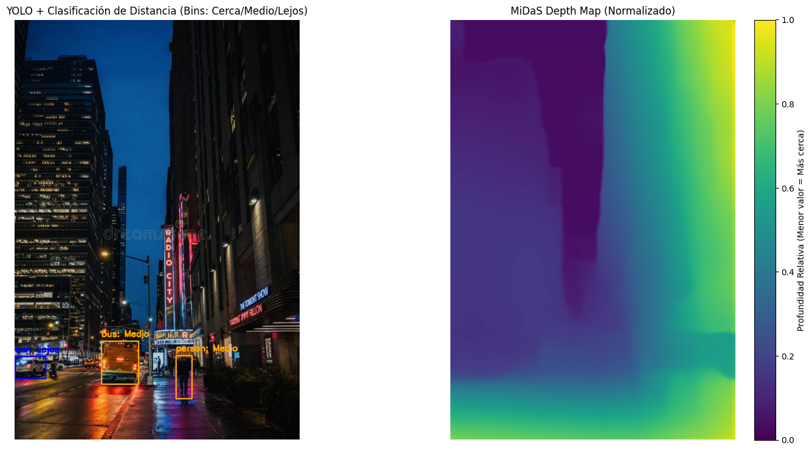

# Práctica de Percepción Multimodal

## Introducción
Este proyecto integra modelos de detección y segmentación para analizar imágenes. Utiliza YOLO para detección de objetos y SAM (Segment Anything Model) para segmentación basada en bounding boxes y prompts de puntos.

---
# 1. YOLO – Resultados de Detección

Este documento presenta las predicciones realizadas con **YOLO11 (Ultralytics)** sobre cinco imágenes capturadas para el laboratorio de detección base.
Cada figura incluye la imagen con bounding boxes, el análisis de confianza y el comportamiento observado del modelo.

---

## Figura 1 – Análisis

**Resumen del modelo:**

| Objeto Detectado | Confianza |
| :--- | :--- |
| `dining_table` | 0.57 |
| `fork` | 0.52 |
| `sandwich` | 0.32 |

**Análisis:**
El modelo identifica correctamente objetos como el tenedor (`fork`) y la mesa (`dining_table`). Sin embargo, presenta un claro error de clasificación al identificar la pieza de carne (chuleta) como un `sandwich`, y además con una confianza muy baja (0.32). También se observan falsos negativos, ya que ignora por completo la ensalada y el puré de papas.

---

## Figura 2 – Análisis

**Resumen del modelo:**

| Objeto Detectado | Confianza |
| :--- | :--- |
| `teddy bear` | 0.54 |
| `bed` | 0.38 |

**Análisis:**
El modelo vuelve a mostrar confusión de clases. Identifica correctamente el contexto (`bed`), aunque con baja confianza. El objeto principal, un peluche de Perry el Ornitorrinco, es erróneamente clasificado como un `teddy bear`, sin embargo puede que la clasificación solo detecte este tipo de objetos como peluches, conocidos generalmente en inglés como `teddy bears`. Falla en detectar objetos más pequeños como el cargador, el cable o el sombrero tejido sobre el peluche.

---

## Figura 3 – Análisis

**Resumen del modelo:**

| Objeto Detectado | Confianza |
| :--- | :--- |
| `dog` | 0.68 |
| `laptop` | 0.64 |

**Análisis:**
El modelo detecta exitosamente al perro (`dog`), a pesar de estar en un ángulo trasero y parcialmente obstruido. El fallo principal aquí es un **falso positivo** claro: detecta una silla como una `laptop` con una confianza relativamente alta de 0.64.

---

## Figura 4 – Análisis

**Resumen del modelo:**

| Objeto Detectado | Confianza |
| :--- | :--- |
| `dog` | 0.86 |
| `chair` | 0.72 |

**Análisis:**
Esta imagen muestra un buen rendimiento. El modelo identifica correctamente y con alta confianza a los dos sujetos principales: el perro (`dog` 0.86) y la silla verde (`chair` 0.72). Los bounding boxes son precisos y no hay detecciones erróneas.

---

## Figura 5 – Análisis

**Resumen del modelo:**

| Objeto Detectado | Confianza |
| :--- | :--- |
| `dog` | 0.88 |

**Análisis:**
Este es el mejor resultado del conjunto. El modelo detecta al perro con una confianza muy alta (0.88) y un bounding box bien ajustado. La iluminación es buena y el fondo (pared azul y escaleras) no genera ninguna confusión ni falso positivo.

---

## Failure Cases Identificados

### **Failure Case 1: Confusión de Clases (Clasificación Errónea)**

Se observa un patrón donde el modelo, al no reconocer un objeto específico, lo asigna a la clase más genérica y visualmente similar que conoce.
* **Ejemplo 1 (Figura 1):** La comida en el plato (carne) es clasificada como `sandwich`.
* **Ejemplo 2 (Figura 2):** El peluche de "Perry el Ornitorrinco" es clasificado como `teddy bear`.
Esto sugiere que el modelo carece de granularidad en sus clases para estos casos.

### **Failure Case 2: Falsos Positivos con Confianza Media**

El modelo genera detecciones incorrectas (falsos positivos) con puntuaciones de confianza que no son lo suficientemente bajas como para ser descartadas automáticamente.
* **Ejemplo (Figura 3):** Un objeto oscuro en primer plano es identificado como `laptop` con una confianza de 0.64. Esto es problemático, ya que un umbral de confianza estándar (como 0.5) no filtraría este error, introduciendo "ruido" en las detecciones.

---

# 3. MiDaS

## Resumen
**Concepto Artístico**: **Urbano** 

### YOLO (Detección Base)

Se utilizó el modelo YOLOv8n para la detección inicial debido a su optimización en velocidad. Su tarea es localizar y etiquetar los objetos clave del entorno urbano (`car`, `person`, `bus`, `traffic light`) para generar las Bounding Boxes (BBoxes), que sirven como las regiones de interés (ROI) para el análisis de profundidad.

### MiDaS (Generación y Análisis del Mapa de Profundidad)

Generación del Mapa

Se empleó el modelo `MiDaS_small` (PyTorch Hub) que es un modelo de estimación de profundidad monocular. Este modelo procesa la imagen RGB y genera un Mapa de Profundidad Relativa para cada píxel. MiDaS no produce distancias métricas (metros), sino la disparidad o profundidad relativa.

**Interpretación**: Los valores bajos en el mapa MiDaS generalmente indican cercanía (alta disparidad), y los valores altos indican lejanía.

Para traducir la profundidad relativa a una métrica accionable, se siguió este proceso:

- Cálculo de Referencia: Se calculó la mediana de profundidad de toda la escena (`scene_depth_median`). Esta mediana actúa como el "punto medio" dinámico de la escena.

- Métrica de Objeto: Para cada BBox de YOLO, se extrajeron los valores del mapa de profundidad MiDaS y se calculó la mediana de esos valores (`avg_object_depth`). Este método es más robusto a los valores atípicos que el promedio simple.

- Clasificación en Bins: Se definieron tres bins de distancia (`Cerca`, `Medio`, `Lejos`) usando umbrales porcentuales de la mediana de la escena (ej., 0.6 y 1.4).

- Ajuste de la Lógica: Debido a la contaminación del BBox (la caja incluye mucho fondo lejano, elevando el valor de la mediana del objeto) o a una salida inesperada del modelo, se aplicó una inversión forzada de etiquetas. Esto aseguró que los objetos con valores de profundidad altos (contaminados, pero físicamente cercanos) se etiquetaran como "Cerca", y viceversa.

## Resultados
### Escena 1

### Escena 2

### Escena 3

### Escena 4

### Escena 5

## Limitaciones y Retos Enfrentados

- Contaminación del Bounding Box (BBox): El desafío más crítico. El BBox de YOLO, al ser rectangular, incluye píxeles del fondo lejano en la región de objetos cercanos (e.g., asfalto detrás de un coche). Estos valores altos sesgan la mediana de profundidad del objeto hacia "Lejos", haciendo incorrecta la clasificación sin una inversión manual de la lógica o sin el uso de segmentación.

- Naturaleza Relativa de MiDaS: La salida es solo relativa (disparidad). La clasificación Cerca/Medio/Lejos es válida solo en el contexto de la escena actual y no se traduce directamente a distancias en metros.

---

## Punto 4: SAM - Segmentación por Prompts

### Introducción
El objetivo de este punto es realizar una segmentación comparativa utilizando dos tipos de prompts:
1. **Prompts de bounding boxes** generados por YOLO.
2. **Prompts de puntos** definidos manualmente o automáticamente.

Esta comparación permite evaluar las fortalezas y limitaciones de cada enfoque en términos de precisión y flexibilidad.

### Metodología
1. **Detección inicial:**
    - Utilizar YOLO para detectar objetos y generar bounding boxes.
2. **Segmentación con prompts de bounding boxes:**
    - Usar las bounding boxes como entrada para SAM.
3. **Segmentación con prompts de puntos:**
    - Definir puntos clave en las imágenes y usarlos como entrada para SAM.
4. **Evaluación comparativa:**
    - Calcular métricas IoU para ambos métodos.
    - Generar visualizaciones comparativas.

### Resultados Comparativos
#### Métricas IoU
--- IoU Scores Summary ---
- **Imagen:** download (1).jpeg
    - Objeto 1: IoU = 0.5360
- **Imagen:** download (2).jpeg
    - Objeto 1: IoU = 0.2994
- **Imagen:** download (3).jpeg
    - Objeto 1: IoU = 0.9799
    - Objeto 2: IoU = 0.9959
    - Objeto 3: IoU = 0.9333
- **Imagen:** download (4).jpeg
    - Objeto 1: IoU = 0.0426
    - Objeto 2: IoU = 0.3505
- **Imagen:** download.jpeg
    - Objeto 1: IoU = 0.2755

#### Visualizaciones Comparativas
Las imágenes generadas se encuentran en el directorio `results/comparativas/`:
- `comparativa_download (1).jpeg`: Muestra diferencias significativas en bordes difusos.
- `comparativa_download (2).jpeg`: Ejemplo de bajo IoU con prompts de puntos.
- `comparativa_download (3).jpeg`: Ejemplo de alto IoU con ambos métodos.
- `comparativa_download (4).jpeg`: Ilustra las limitaciones de bounding boxes en objetos pequeños.
- `comparativa_download.jpeg`: Caso con IoU moderado.

### Código Python
El código utilizado para realizar la segmentación y calcular las métricas IoU se encuentra en el archivo `practica_sam.py`, ubicado en /colab_links. Este archivo incluye:
- Implementación de la segmentación con SAM utilizando bounding boxes y prompts de puntos.
- Cálculo de métricas IoU para evaluar la precisión de las máscaras generadas.
- Generación de las imágenes comparativas almacenadas en el directorio `results/comparativas/`.

### Referencias a Imágenes
Las imágenes generadas durante la práctica se encuentran organizadas en el directorio `results/comparativas/`. Estas imágenes muestran las máscaras generadas por SAM utilizando los dos tipos de prompts y permiten una comparación visual de los resultados.

- **Ejemplo de imágenes generadas:**
  - `comparativa_download (1).jpeg`: Muestra diferencias significativas en bordes difusos.
  - `comparativa_download (2).jpeg`: Ejemplo de bajo IoU con prompts de puntos.
  - `comparativa_download (3).jpeg`: Ejemplo de alto IoU con ambos métodos.
  - `comparativa_download (4).jpeg`: Ilustra las limitaciones de bounding boxes en objetos pequeños.
  - `comparativa_download.jpeg`: Caso con IoU moderado.

Para más detalles sobre cómo ejecutar el código y generar estos resultados, consulta las instrucciones en el archivo `segmentacion_practica.py`.

### Análisis Comparativo
- **Bounding Boxes:**
    - Generan máscaras precisas cuando los objetos están claramente delimitados.
    - Limitaciones: En objetos con bordes difusos, las máscaras pueden ser menos precisas.
    - Ejemplo: En `comparativa_download (4).jpeg`, los objetos pequeños no se segmentan correctamente.
- **Prompts de Puntos:**
    - Más flexibles para ajustar la segmentación en áreas específicas.
    - Limitaciones: Requieren puntos bien definidos para obtener buenos resultados.
    - Ejemplo: En `comparativa_download (2).jpeg`, los puntos mal colocados generan un IoU bajo.

En general, los prompts de bounding boxes son más adecuados para objetos grandes y bien definidos, mientras que los prompts de puntos ofrecen mayor flexibilidad en casos complejos.

---
