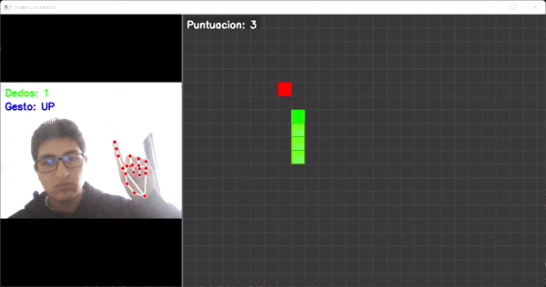

# Taller 3 — Taller Integral de Computación Visual
**Fecha:** 2025-11-07  
**Integrantes:** Javier Giraldo, Miguel Martinez, Brayan Rubiano, Jesús Quiñones.

---


## Descripción general

Este taller integral busca **diseñar y curar experiencias visuales interactivas** que integren diferentes componentes del pipeline gráfico y sensorial.
Los ejercicios combinan modelado 3D, materiales PBR, shaders personalizados, texturas dinámicas, interacción multimodal (voz, gestos, EEG) y control de cámara o entorno.

El objetivo es conectar percepción visual, física de la luz, geometría procedural y comunicación humano–máquina, consolidando las habilidades de integración entre arte, código y percepción.

---

## Actividades desarrolladas

### 1. Materiales, luz y color (PBR y modelos cromáticos)
- Implementación de texturas PBR (albedo, roughness, metalness, normal map).
- Iluminación múltiple (key, fill, rim, HDRI).
- Cámaras: alternancia entre perspectiva y ortográfica.
- Paletas RGB/HSV y contraste en CIELAB.
- Animaciones demostrando variaciones de luz y material.

### 2. Modelado procedural desde código
- Generación algorítmica de geometría (rejillas, espirales, fractales simples).
- Uso de bucles y recursión para patrones espaciales.
- Transformaciones dinámicas de vértices.
- Comparativa entre modelado por código y manual.

### 3. Shaders personalizados y efectos
- Implementación de shaders básicos (GLSL, HLSL, Shader Graph).
- Color dinámico por posición, tiempo o interacción.
- Efectos de toon shading, wireframe, distorsión UV y gradientes.
- Texturizado procedural y mezcla de mapas dinámicos.

### 4. Texturizado dinámico y partículas
- Materiales reactivos a tiempo o entradas del usuario.
- Mapas animados: emissive, normal, offset UV, ruido procedural.
- Integración de sistemas de partículas sincronizados con shaders.
- Evento visual coordinado shader + partículas.

### 5. Visualización de imágenes y video 360°
- Implementación de skybox o esfera invertida para escenas 360°.
- Uso de video equirectangular como textura dinámica.
- Conmutación entre panoramas o escenas.
- Control de cámara (orbit, giroscopio, entrada de usuario).

### 6. Entrada e interacción (UI, input y colisiones)
- Captura de teclado, mouse y touch.
- Uso de UI Canvas o HTML para interacción visual.
- Colisiones físicas o triggers que disparan efectos.
- Sincronización de eventos visuales con acciones del usuario.

### 7. Gestos con cámara web (MediaPipe Hands)
- Detección de manos en tiempo real con MediaPipe + OpenCV.
- Conteo de dedos, detección de gestos y distancias.
- Mapeo de gestos a acciones visuales.
- Implementación de minijuego o interfaz gestual.

### 8. Reconocimiento de voz y control por comandos
- Captura de audio con SpeechRecognition/PyAudio.
- Reconocimiento local o online.
- Diccionario de comandos y acciones visuales.
- Integración con Unity o Processing mediante OSC.
- Retroalimentación auditiva con pyttsx3.

### 9. Interfaces multimodales (voz + gestos)
- Integración simultánea de voz y gestos.
- Sincronización de hilos y eventos.
- Lógica condicional para acciones combinadas.
- Interfaz visual reactiva con retroalimentación.

### 10. Simulación BCI (EEG sintético y control)
- Generación de señales EEG sintéticas (bandas Alpha/Beta).
- Filtros pasa banda y umbrales de activación.
- Control visual a partir de variaciones EEG.
- Interfaz interactiva con PyGame o Tkinter.

### 11. Espacios proyectivos y matrices de proyección
- Uso de coordenadas homogéneas y proyecciones.
- Implementación de matrices ortográficas y perspectiva.
- Visualización de profundidad y alternancia de cámaras.

---

## Herramientas utilizadas
- **Unity (versión LTS)**
- **Three.js / React Three Fiber**
- **Python (Colab o local)**
- **Processing (2D/3D)**
- **Librerías y complementos:** MediaPipe, SpeechRecognition, OSC, OpenCV, PyGame, Tkinter.

---

## Resultados esperados
- 6 capturas de escenas distintas.
- 6 GIFs mostrando interacción y shaders dinámicos.
- 1 video (30–60 s) de la experiencia completa.
- Código ejecutable y documentado.

---

## Criterios de evaluación

| Criterio                                | Descripción                                   | Peso |
| --------------------------------------- | --------------------------------------------- | ---- |
| Organización                            | Estructura de carpetas y README claros        | 10%  |
| Modelado y geometría procedural         | Generación y coherencia de formas             | 10%  |
| Materiales e iluminación PBR            | Realismo, coherencia y respuesta a la luz     | 15%  |
| Shaders y texturizado dinámico          | Efectos visuales y complejidad técnica        | 15%  |
| Interacción multimodal (voz/gestos/EEG) | Integración funcional y creativa              | 15%  |
| Cámaras y proyección                    | Uso correcto de perspectiva/orto y movimiento | 10%  |
| Animaciones y partículas                | Movimiento expresivo, sincronización visual   | 10%  |
| Evidencias visuales                     | GIFs, videos y capturas claras                | 10%  |
| Código y documentación                  | Claridad, comentarios y commits en inglés     | 5%   |
| **Total**                               |                                               | **100%** |

---

# Subproyecto: Geometría Procedural, Shaders y Espacios Proyectivos

## Estructura

```
2025-11-07_taller_3_integrado_computacion_visual/
├── renders/                 #Generated GIFs & Images.
├── unity/
    ├── T3_Int_Sec_2_3_11/   #Folder with Unity Scene objects and structure
        ├── Assets/
           ├── Materials/    #Procedural Material.
           ├── Scripts/      #Game Object procedural behaviour gen & Camera Projection Switch.
           ├── Shaders/      #HLSL Custom Procedural Shader.
├── README.md                #You are here man.
```

#### Implementación: Brayan Rubiano
## IMPORTANTE: [Enlace implementación subproyecto completa](https://github.com/brubianop/VisualComputingUN2025II/tree/main/2025-11-07_Taller_3_Integrado)
Este documento describe la implementación de técnicas de gráficos por computadora en Unity (Universal Render Pipeline, URP), enfocándose en la generación de geometría dinámica y shaders procedurales.


---

## 1. Introducción

El objetivo de este proyecto es demostrar las capacidades de la **Generación Procedural en CPU** (C#) y el **Renderizado Procedural en GPU** (HLSL) para crear un efecto de onda dinámica y coloreada.

---

## 2. Secciones Implementadas

El proyecto aborda y completa las siguientes secciones del taller:

| Sección | Tema | Implementación |
| :--- | :--- | :--- |
| **Sección 2** | **Geometría Procedural (CPU)** | Generación de una malla de plano dinámica. Deformación en tiempo real de los vértices (altura **Y**) usando una función **senoidal 1D** (`ProceduralWaveGen.cs`). |
| **Sección 3 & 4** | **Shaders Procedurales (GPU)** | Implementación de un *shader* URP en **HLSL** (`ProceduralURPHLSL.shader`). El color se calcula en el *Fragment Shader* basándose en la **posición mundial** (`positionWS`) y el **tiempo** (`_Time.y`). |
| **Sección 11** | **Proyección de Cámara** | Control de la vista de la cámara, permitiendo el *toggle* entre proyecciones `Perspectiva` y `Ortografica` (Barra Espaciadora commo *Trigger*). |


## 3. Componentes Clave del Código

| Archivo | Objeto Asignado | Función Principal |
| :--- | :--- | :--- |
| **`ProceduralWaveGen.cs`** | `ProceduralWave` | Genera la malla (`Mesh`), almacena las posiciones base (`baseVertices`), y calcula la deformación de la onda en `Update()`. |
| **`ProceduralURPHLSL.shader`** | `ProceduralMat` | Contiene el código HLSL para calcular el color dinámico y el mapeo. |
| **`CameraSwitch.cs`** | `Main Camera` | Fija la posición de cámara inicial y gestiona el *toggle* de proyección al presionar la **Barra Espaciadora**. |

## 4. Código Relevante
#### `ProceduralWaveGen.cs`
```csharp
void CreateProceduralMesh()
{
    // Vertex and UV gen
    List<Vector3> vertices = new List<Vector3>();
    List<Vector2> uvs = new List<Vector2>();

    for (int i = 0; i <= resolution; i++)
    {
        for (int j = 0; j <= resolution; j++)
        {
            // Vertex pos. Center at (0, 0, 0)
            float x = (float)i / resolution * size - size / 2f;
            float z = (float)j / resolution * size - size / 2f;
            vertices.Add(new Vector3(x, 0, z));
            uvs.Add(new Vector2((float)i / resolution, (float)j / resolution));
        }
    }
    mesh.vertices = vertices.ToArray();
    mesh.uv = uvs.ToArray();

    // Triangle gen -> Quad gen.
    List<int> triangles = new List<int>();
    for (int i = 0; i < resolution; i++)
    {
        for (int j = 0; j < resolution; j++)
        {
            int a = i * (resolution + 1) + j;
            int b = a + 1;
            int c = (i + 1) * (resolution + 1) + j;
            int d = c + 1;

            // Quad triangulation
            triangles.Add(a); triangles.Add(c); triangles.Add(b);
            triangles.Add(b); triangles.Add(c); triangles.Add(d);
        }
    }
    mesh.triangles = triangles.ToArray();
    mesh.RecalculateNormals();
}

void Update()
{
    if (baseVertices == null || baseVertices.Length == 0) return;

    currentVertices = mesh.vertices;

    for (int i = 0; i < currentVertices.Length; i++)
    {
        Vector3 basePos = baseVertices[i];

        // Wave behaviour. (Sine function used)
        float waveY = amplitude * Mathf.Sin(
            (basePos.x * frequency) + (Time.time * speed)
        );

        // New Height recalc.
        currentVertices[i] = new Vector3(basePos.x, waveY, basePos.z);
    }

    mesh.vertices = currentVertices;
    mesh.RecalculateNormals();
    mesh.RecalculateBounds();

}
```

#### `ProceduralURPHLSL.shader`
``` csharp
HLSLPROGRAM

#pragma vertex vert
#pragma fragment frag

#include "Packages/com.unity.render-pipelines.universal/ShaderLibrary/Core.hlsl"

struct Attributes {
    float4 positionOS : POSITION;
};

struct Varyings {
    float4 positionCS : SV_POSITION;
    float3 positionWS : TEXCOORD0; // Vertex pos in World Space
};

CBUFFER_START(UnityPerMaterial)
    float4 _Color;
    float _Frequency;
    float _Speed;
CBUFFER_END

// Vertex Shader
Varyings vert (Attributes input) {
    Varyings output;
    output.positionCS = TransformObjectToHClip(input.positionOS.xyz);
    output.positionWS = TransformObjectToWorld(input.positionOS.xyz);

    return output;
}

// Fragment Shader (Procedural Color Calc.)
float4 frag (Varyings input) : SV_Target {

    float time = _Time.y;

    // Color given time and pos.
    float r_comp = sin(input.positionWS.x * _Frequency + time * _Speed);
    float g_comp = sin(input.positionWS.z * _Frequency * 1.5 + time * _Speed * 1.5);

    // Mapping. Normalization from [-1, 1] -> [0, 1] coords..
    float intensityR = r_comp * 0.5 + 0.5;
    float intensityG = g_comp * 0.5 + 0.5;
    float intensityB = input.positionWS.y * 0.1 + 0.5; // BLUE -. Height

    float4 proceduralColor = float4(intensityR, intensityG, intensityB, 1.0);

    // Mix Procedural Color and Base Color
    return proceduralColor * _Color;
}
ENDHLSL
```

#### `CameraSwitch.cs`
``` csharp
private Camera mainCamera;
void Start()
{
    mainCamera = GetComponent<Camera>();
    mainCamera.orthographic = false; // DEFAULT = PERSPECTIVE

    // Initial Camera pos.
    transform.position = new Vector3(25, 20, -30);
    transform.rotation = Quaternion.Euler(30, -45, 0);

    mainCamera.fieldOfView = 80;
}


void Update()
{
    // Camera Switch trigger = SpaceBar.
    if (Input.GetKeyDown(KeyCode.Space))
    {
        // Switch Projection
        mainCamera.orthographic = !mainCamera.orthographic;

        if (mainCamera.orthographic)
        {
            // Ortho adjustment. Size.
            mainCamera.orthographicSize = 18;
            Debug.Log("ORTHOGRAPHIC: (Sec. 11).");
        }
        else
        {
            Debug.Log("PERSPECTIVE:(Sec. 11).");
        }
    }
}
```

# Subproyecto: Materiales, Luz y Visualización 360°

## **Propiedades Probadas**

### **1. Materiales, luz y color (PBR y modelos cromáticos)**
- **Texturas PBR:**
  - Propiedades: albedo, roughness, metalness.
  - Aplicación de materiales dinámicos a objetos.
- **Iluminación múltiple:**
  - Configuración de luces Key, Fill y Rim.
  - Variaciones dinámicas de luz en la escena.
- **Paleta de colores dinámica:**
  - Uso de un script personalizado para asignar colores.
  - Animaciones que demuestran cambios en tiempo real.

### **2. Visualización de imágenes y video 360°**
- **Esfera invertida:**
  - Creación de una esfera con normales invertidas.
  - Uso de un shader personalizado para invertir las normales.
- **Textura equirectangular:**
  - Aplicación de una imagen equirectangular como textura.
  - Configuración de la cámara para explorar la imagen 360°.

---
## **Implementación:**

### **1. Materiales, luz y color (PBR y modelos cromáticos)**
- Se crearon materiales PBR con texturas básicas y se asignaron a objetos 3D.
- Se configuraron luces direccionales (Key, Fill, Rim) para iluminar la escena.
- Se implementó una paleta de colores dinámica utilizando un script personalizado.
- Se animaron propiedades de materiales, como el color, para demostrar variaciones dinámicas.

### **5. Visualización de imágenes y video 360°**
- Se creó una esfera invertida para mostrar imágenes equirectangulares.
- Se asignó un material con un shader personalizado para invertir las normales.
- Se importó y aplicó una imagen equirectangular como textura al material.
- La cámara se posicionó dentro de la esfera para explorar la imagen 360°.

---

## Evidencias

### GIF de Iluminación
- **Descripción**: Este GIF muestra cómo las luces (Key, Fill y Rim) afectan a los materiales PBR en la escena al moverlas dinámicamente.
- **Ubicación**: El archivo GIF se encuentra en la carpeta `renders/` con el nombre `iluminacion_dinamica.gif`.

```plaintext
renders/
├── iluminacion_dinamica.gif
```

### GIF Resumen del Taller
- **Descripción**: Este GIF muestra un resumen de las actividades realizadas en el taller, incluyendo:
  - Cambios dinámicos en materiales y luces.
  - Exploración de la esfera invertida con imagen equirectangular.
- **Ubicación**: El archivo GIF se encuentra en la carpeta `renders/` con el nombre `Taller3_Resumen.gif`.

```plaintext
renders/
├── iluminacion_dinamica.gif
├── Taller3_Resumen.gif
```


---

## Contribuciones Grupales

- **Miguel Martinez** — Organización del repositorio inicial, desarrollo de los puntos 1 (Materiales, luz y color) y 5 (Visualización de imágenes y video 360°).

---
## Subproyecto: SnakeVision - Control Gestual Intuitivo

### Tecnologías Implementadas

- **Python 3.8+**: Lenguaje de programación principal
- **OpenCV**: Procesamiento de imágenes y video en tiempo real
- **MediaPipe Hands**: Detección y seguimiento de landmarks de manos
- **NumPy**: Operaciones matemáticas y manejo de arrays
- **Conda**: Gestión de entorno y dependencias

### Descripción

SnakeVision es una implementación moderna del clásico juego Snake, donde el control se realiza mediante gestos de mano detectados por una cámara web. El proyecto combina visión por computadora con gaming tradicional, creando una experiencia de juego inmersiva y natural.

**Características principales:**
- Control gestual intuitivo sin hardware adicional
- Interfaz dividida: cámara en tiempo real + juego
- Sistema de puntuación con crecimiento progresivo
- Detección robusta de gestos con feedback visual
- Mecánicas de juego optimizadas para control gestual

### Códigos Destacados

#### 1. Sistema de Detección de Gestos (`hand_gesture_controller.py`)

```python
def get_gesture(self, fingers):
    """Convierte el conteo de dedos en gestos para el juego"""
    count = sum(fingers)
    
    if count == 0:  # Puño cerrado
        return "STOP"
    elif count == 1 and fingers[1] == 1:  # Solo índice
        return "UP"
    elif count == 2 and fingers[1] == 1 and fingers[2] == 1:  # Índice y medio
        return "RIGHT"
    # ... más gestos
```

**Importancia**: Este algoritmo traduce la configuración de dedos en comandos de juego, usando landmarks específicos de MediaPipe para determinar qué dedos están extendidos.

#### 2. Lógica Principal del Juego (`snake_game.py`)

```python
def update(self, gesture):
    # Control de velocidad
    current_time = time.time()
    if current_time - self.last_update_time < self.game_speed:
        return
        
    # Mecánica de crecimiento al comer
    if new_head == self.food:
        self.score += 1
        self.food = self.generate_food()
        # NO remover la cola - la serpiente crece
    else:
        self.snake.pop()  # Solo remover cola si no comió
```

**Importancia**: Implementa el núcleo del juego con control de velocidad optimizado y la mecánica clave de crecimiento de la serpiente.

#### 3. Integración y Visualización (`main.py`)

```python
# Procesamiento en tiempo real
annotated_frame, gesture = gesture_controller.process_frame(frame_resized)
snake_game.update(gesture)

# Interfaz dividida 1/3 - 2/3
combined_canvas = np.zeros((combined_height, combined_width, 3), dtype=np.uint8)
combined_canvas[cam_y_offset:cam_y_offset + target_cam_height, 0:target_cam_width] = annotated_frame
snake_game.draw(combined_canvas, x_offset=game_x_offset, y_offset=game_y_offset)
```

**Importancia**: Coordina todos los componentes y gestiona la interfaz de usuario unificada.

### Manejo de los Gestos

#### Mapeo Gestual → Comandos

| Gesto | Dedos | Comando | Función |
|-------|-------|---------|---------|
| 🖐️ Mano abierta | 5 dedos | `START` | Iniciar/Reiniciar juego |
| ☝️ Solo índice | 1 dedo | `UP` | Mover hacia arriba |
| ✌️ Índice + medio | 2 dedos | `RIGHT` | Mover hacia derecha |
| 🤟 Índice + medio + anular | 3 dedos | `DOWN` | Mover hacia abajo |
| 🖖 4 dedos | 4 dedos | `LEFT` | Mover hacia izquierda |
| ✊ Puño cerrado | 0 dedos | `STOP` | Pausar juego |
| ✊ × 3 segundos | 0 dedos (hold) | `EXIT` | Salir del juego |

#### Algoritmo de Detección

1. **Detección de Landmarks**: MediaPipe identifica 21 puntos clave por mano
2. **Análisis de Posición**: Compara posiciones y-axis entre puntas y articulaciones
3. **Clasificación de Gestos**: Cuenta dedos extendidos y mapea a comandos
4. **Suavizado**: Evita cambios bruscos manteniendo estado anterior

### Evidencias

Se evidencia el uso de los gestos tal como se observa a continuación:



El video completo se puede ver desde el documento 
**Ejemplos de evidencias a incluir:**
- Captura de pantalla mostrando la interfaz dividida
- GIF demostrando el control gestual en acción
- Secuencia de gestos reconocidos por el sistema
- Ejemplo de gameplay con aumento de puntuación

### Conclusiones

#### Logros del Proyecto

1. **Control Intuitivo**: Se logró un sistema de control gestual natural que no requiere aprendizaje complejo
2. **Precisión en Detección**: MediaPipe provee detección robusta incluso en diferentes condiciones de iluminación
3. **Rendimiento Optimizado**: El juego mantiene 60 FPS mientras procesa video en tiempo real
4. **Experiencia de Usuario**: La interfaz dividida permite verificar gestos mientras se juega

#### Desafíos Superados

- **Sincronización**: Coordinar la velocidad de detección con la velocidad del juego
- **Calibración**: Ajustar sensibilidad para evitar detecciones falsas
- **Feedback Visual**: Proporcionar información clara sobre gestos detectados

#### Aplicaciones Futuras

El framework desarrollado puede extenderse para:
- Control de otras aplicaciones mediante gestos
- Sistemas de rehabilitación con terapia gestual
- Interfaces para personas con movilidad reducida
- Juegos más complejos con vocabulario gestual expandido

#### Impacto Tecnológico

SnakeVision demuestra que es posible crear experiencias interactivas completas usando únicamente visión por computadora, eliminando la necesidad de controladores físicos y abriendo posibilidades para interfaces más naturales e inclusivas.

#### Uso de IA
Se implementó *Deepseek* principalmente para el desarrollo de la documentación.


---

# Reflexión final

Este taller integra todos los componentes explorados durante el curso, conectando **percepción, interacción y visualización avanzada**.
El trabajo consolida una comprensión práctica del pipeline gráfico moderno, resaltando la importancia del diseño sensorial, la respuesta visual coherente y la documentación técnica reproducible.

---

## Estructura del repositorio

```plaintext
2025-10-17_taller_3_integrado_computacion_visual/
├── unity/           # Escenas y materiales PBR
├── threejs/         # Experimentos WebGL / R3F
├── python/          # Scripts de procesamiento o EEG
├── processing/      # Sketches visuales 2D/3D
├── renders/         # Capturas y GIFs
├── media/           # Videos o audios usados
└── README.md
```