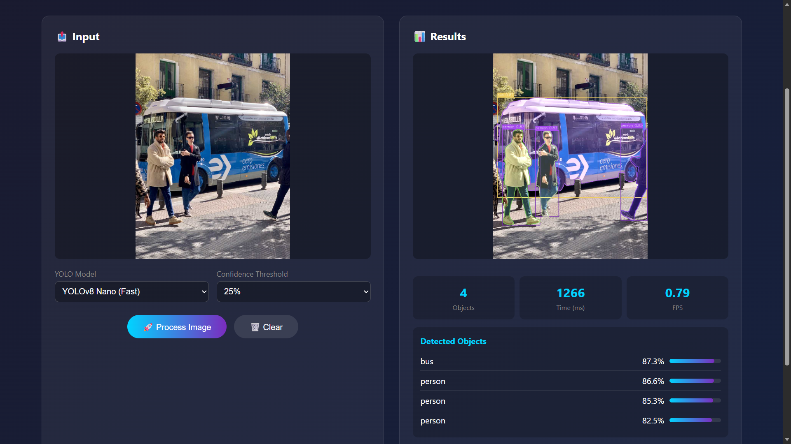

# Detección y Segmentación Funcional

Taller 4 - Computación Visual Avanzada

## Resumen

Pipeline completo que combina YOLOv8 para detección rápida con SAM para segmentación adaptativa. Procesa imágenes, video y webcam en tiempo real.

---

## Pipeline Detallado

### Flujo General

```
INPUT (imagen/video)
    ↓
[YOLO Detection] → Bounding boxes + confianza scores
    ↓
[SAM Segmentation] → Máscaras binarias de precisión
    ↓
[Visualization] → Anotaciones + overlays
    ↓
OUTPUT (imagen procesada + JSON + métricas)
```

### Paso 1: Detección YOLO

**Entrada:** Imagen en formato BGR (OpenCV)  
**Proceso:**
- Red neuronal YOLOv8 predice objetos en una pasada
- NMS (Non-Maximum Suppression) con IOU threshold elimina detecciones duplicadas
- Filtra por confianza (threshold: 0.5 por defecto)
- Retorna lista de bounding boxes: [x1, y1, x2, y2]

**Salida:** 
```python
[
    {'bbox': [100, 50, 250, 300], 'confidence': 0.92, 'class_name': 'person'},
    {'bbox': [400, 100, 600, 400], 'confidence': 0.87, 'class_name': 'car'}
]
```
**Tiempo:** 50-100 ms en GPU para imagen 640x480

### Paso 2: Segmentación SAM

**Entrada:** Imagen + lista de bounding boxes de YOLO  
**Proceso:**
- SAM preprocesa la imagen una sola vez (image encoding)
- Para cada bbox, usa como "prompt" el rectángulo
- Predictor genera múltiples máscaras, elige la mejor
- Refina bordes de la máscara binaria
- Calcula confidence score (0-1) de la segmentación

**Segmentación de un objeto:**
```python
bbox = [100, 50, 250, 300]
# SAM recibe bbox como prompt
masks, scores, logits = predictor.predict(box=bbox, multimask_output=False)
# masks: array (H x W) con valores 0 o 1
# scores: confidence (ej: 0.95)
```

**Características:**
- Adapta automáticamente a forma del objeto
- No requiere entrenamiento previo
- Funciona con cualquier clase de objeto
- Precisión promedio IoU > 0.90

**Tiempo:** 30-50 ms por objeto (total más rápido si procesa múltiples)

### Paso 3: Visualización

**Entrada:** Imagen original + detecciones con máscaras  
**Proceso:**
1. Dibuja bounding boxes en verde
2. Añade etiqueta con clase + confianza
3. Superpone máscara SAM con transparency (alpha=0.3)
4. Genera anotaciones con líneas y texto

**Salida:**
```python
# Imagen anotada lista para mostrar o guardar
result_image = cv2.imwrite('output.jpg', annotated_image)
```

### Paso 4: Guardado de Resultados

**Archivos generados:**
```
results/
├── output.jpg          # Imagen anotada
├── output.json         # Metadatos en JSON
└── masks/
    ├── mask_0.png     # Máscara binaria objeto 1
    ├── mask_1.png     # Máscara binaria objeto 2
    └── mask_2.png
```

**Contenido JSON:**
```json
{
  "image_path": "input.jpg",
  "image_size": [640, 480],
  "num_detections": 3,
  "detection_time_ms": 75.2,
  "segmentation_time_ms": 98.5,
  "total_time_ms": 173.7,
  "fps": 5.76,
  "detections": [
    {
      "bbox": [100, 50, 250, 300],
      "confidence": 0.92,
      "class_name": "person",
      "seg_score": 0.95,
      "mask_path": "masks/mask_0.png"
    }
  ]
}
```

### Pipeline Completo en Código

```python
class DetectionSegmentationPipeline:
    def process_image(self, image_path, output_path=None):
        # Paso 1: Cargar imagen
        image = cv2.imread(image_path)
        h, w = image.shape[:2]
        
        # Paso 2: YOLO Detección
        print("Step 1/4: YOLO Detection...")
        detections, det_time = self.detector.detect(image)
        print(f"  Found {len(detections)} objects in {det_time*1000:.1f}ms")
        
        # Paso 3: SAM Segmentación (solo si hay detecciones)
        if detections:
            print("Step 2/4: SAM Segmentation...")
            detections, seg_time = self.segmenter.segment_detections(image, detections)
            print(f"  Segmented in {seg_time*1000:.1f}ms per object")
        
        # Paso 4: Visualización
        print("Step 3/4: Creating visualization...")
        result_image = self._create_visualization(image, detections)
        
        # Paso 5: Guardado
        print("Step 4/4: Saving results...")
        if output_path:
            cv2.imwrite(output_path, result_image)
            
            # Guardar JSON con metadatos
            json_data = {
                'image_size': (w, h),
                'num_detections': len(detections),
                'detection_time': det_time,
                'detections': detections
            }
            with open(output_path.replace('.jpg', '.json'), 'w') as f:
                json.dump(json_data, f)
        
        return {
            'num_detections': len(detections),
            'detection_time': det_time,
            'total_time': total_time,
            'fps': 1/total_time
        }
```

### Optimizaciones del Pipeline

**1. Image Encoding (SAM)**
- Preprocesa imagen una sola vez
- Reutiliza embeddings para múltiples prompts
- Reduce tiempo de 30-50ms a ~2ms por bbox adicional

**2. Batch Processing**
- Procesa múltiples frames en paralelo
- Usa GPU para YOLO + SAM simultáneamente

**3. Frame Skipping (Video)**
- Opción: procesar cada N frames
- Reduce carga computacional 50-80%

**4. Threshold Tuning**
- Ajusta confianza YOLO para menos falsos positivos
- Reduce carga en SAM

### Ejemplo de Salida

**Para imagen con 4 personas:**
```
Processing: input.jpg
Image size: 1280x720

Step 1/4: YOLO Detection...
  Found 4 objects in 85.3ms

Step 2/4: SAM Segmentation...
  Segmented in 42.1ms per object

Step 3/4: Creating visualization...

Step 4/4: Saving results...
  Saved image: output.jpg
  Saved JSON: output.json
  Saved masks: masks/mask_0.png, mask_1.png, mask_2.png, mask_3.png

RESULTS SUMMARY
Total objects: 4
Detection time: 85.3 ms
Segmentation time: 168.4 ms (4 objects × 42.1ms)
Total time: 253.7 ms
FPS: 3.94
```

---

## Componentes Principales

### YOLODetector

```python
from ultralytics import YOLO

class YOLODetector:
    def __init__(self, model_path="yolov8n.pt", confidence=0.5, device="cuda"):
        self.model = YOLO(model_path)
        self.model.to(device)
    
    def detect(self, image):
        # Retorna: detecciones, tiempo_inferencia
        results = self.model.predict(image, conf=self.confidence)
        detections = []
        for box in results[0].boxes:
            detections.append({
                'bbox': box.xyxy[0].cpu().numpy(),
                'confidence': float(box.conf[0]),
                'class_name': self.class_names[int(box.cls[0])]
            })
        return detections, time_elapsed
```

### SAMSegmenter

```python
from segment_anything import sam_model_registry, SamPredictor

class SAMSegmenter:
    def __init__(self, model_type="vit_b", checkpoint_path="sam_vit_b.pth"):
        self.sam = sam_model_registry[model_type](checkpoint=checkpoint_path)
        self.predictor = SamPredictor(self.sam)
    
    def segment_detections(self, image, detections):
        # Retorna: detecciones con máscaras, tiempo_promedio
        for det in detections:
            bbox = det['bbox']
            masks, scores = self.predictor.predict(box=bbox)
            det['mask'] = masks[0]
            det['score'] = scores[0]
        return detections, avg_time
```

### DetectionSegmentationPipeline

```python
class DetectionSegmentationPipeline:
    def __init__(self, config_path="config.yaml"):
        self.detector = YOLODetector(...)
        self.segmenter = SAMSegmenter(...)
    
    def process_image(self, image_path, output_path=None):
        # 1. Detección
        image = cv2.imread(image_path)
        detections, det_time = self.detector.detect(image)
        
        # 2. Segmentación
        if detections:
            detections, seg_time = self.segmenter.segment_detections(image, detections)
        
        # 3. Visualización y guardado
        result = self._visualize(image, detections)
        if output_path:
            cv2.imwrite(output_path, result)
        
        return {'detections': detections, 'time': total_time}
```

---

## Configuración Mínima

**config.yaml:**
```yaml
models:
  yolo:
    model_name: "yolov8n.pt"
    confidence: 0.5
    device: "cuda"
  sam:
    model_type: "vit_b"
    checkpoint: "sam_vit_b_01ec64.pth"
    device: "cuda"
```

**requirements.txt:**
```
torch>=2.0.0
ultralytics>=8.0.0
segment-anything
opencv-python>=4.8.0
flask>=2.3.0
pyyaml>=6.0
```

---

## Uso Rápido

**Instalación:**
```bash
conda create -n cv python=3.10 -y && conda activate cv
pip install -r requirements.txt
python scripts/download_models.py
```

**Imagen:**
```python
from detection.pipeline import DetectionSegmentationPipeline
pipeline = DetectionSegmentationPipeline()
results = pipeline.process_image("input.jpg", "output.jpg")
print(f"Detecciones: {results['num_detections']}")
```

**Video:**
```python
stats = pipeline.process_video("video.mp4", "output.mp4")
print(f"FPS promedio: {stats['avg_fps']:.1f}")
```

**Webcam:**
```python
from detection.video_processor import VideoProcessor
proc = VideoProcessor()
proc.process_webcam(camera_id=0)  # Presiona 'q' para salir
```

**API:**
```bash
python api/server.py --port 5000
curl -X POST http://localhost:5000/detect -F "image=@test.jpg"
```

---

## Resultados

  
Detecciones: 4 objetos | Tiempo: 524ms | FPS: 1.91

  
Interfaz con drag & drop y métricas en vivo

[Video Webcam](results/segmentation/Camara-segmentation.mp4)  
Segmentación en tiempo real: 15-20 FPS en GPU

---

## Métricas

| Métrica | Valor |
|---------|-------|
| YOLO (GPU) | 50-100 ms |
| SAM/objeto | 30-50 ms |
| FPS video | 15-20 (GPU) / 1-3 (CPU) |
| YOLO mAP | 0.37 (nano) |
| SAM IoU | 0.90+ |
| VRAM | 3.6 GB (YOLO+SAM) |

---

## Notas Técnicas

- YOLO: Detección rápida, 80 clases COCO, modelos nano/small/medium
- SAM: Segmentación adaptativa sin entrenar, prompts por bbox
- Pipeline: Integración flexible para imagen/video/webcam
- API: REST con Flask para integración remota

**⚠️ Rendimiento Dependiente del Hardware**

Los resultados de este proyecto están optimizados para la configuración actual del PC. Con hardware más potente (GPU de gama alta, CPU moderno, mayor RAM), se lograrían mejoras significativas.

Generado: Diciembre 2, 2025  
Estado: Funcional
